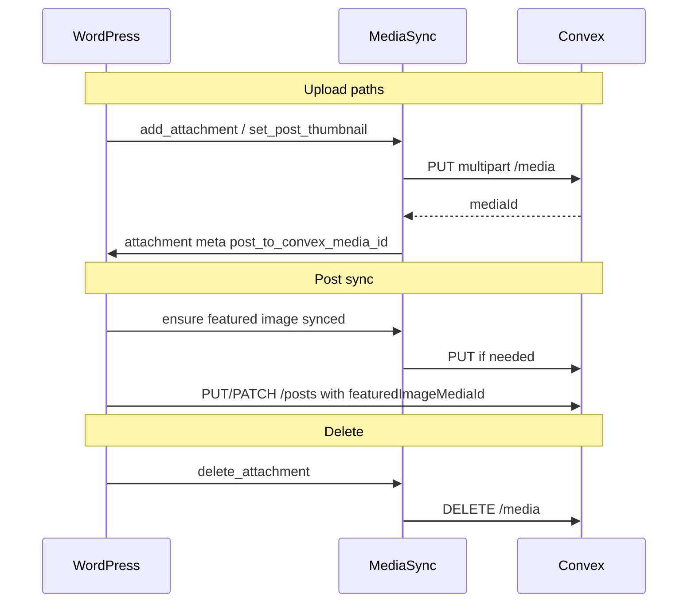

# Convex media attachment sync

## Context

The plugin today syncs **posts** and **taxonomy terms** to Convex via `wp_remote_*` + Bearer auth ([`RestApi.php`](wp-content/plugins/post-to-convex/includes/RestApi.php), [`TaxonomyFields.php`](wp-content/plugins/post-to-convex/includes/TaxonomyFields.php)). There is **no** attachment handling yet. Post sync is manual from the block editor and reads persisted DB content via `build_convex_post_fields()`.

Media sync must run **outside** the `is_admin()` gate in [`Plugin.php`](wp-content/plugins/post-to-convex/includes/Plugin.php) (unlike `TaxonomyFields`) so REST/block-editor uploads still trigger hooks.



## 1. Attachment meta

Add [`includes/AttachmentMeta.php`](wp-content/plugins/post-to-convex/includes/AttachmentMeta.php) mirroring [`PostMeta.php`](wp-content/plugins/post-to-convex/includes/PostMeta.php):

-   Constant: `MEDIA_ID_META_KEY = 'post_to_convex_media_id'`
-   Register on `attachment` post type via `register_post_meta()` (`type: string`, `single: true`, `show_in_rest: true`, auth: `current_user_can( 'edit_post', $object_id )`)
-   Boot from [`Plugin::boot()`](wp-content/plugins/post-to-convex/includes/Plugin.php) alongside `PostMeta::init()`

## 2. Media sync service

Add [`includes/MediaSync.php`](wp-content/plugins/post-to-convex/includes/MediaSync.php) as the single place for Convex media HTTP + WordPress hooks.

### Convex API

| Operation | Method   | URL                                     | Body                        |
| --------- | -------- | --------------------------------------- | --------------------------- |
| Upload    | `PUT`    | `{cloud_url}/api/postToConvex/v1/media` | `multipart/form-data`       |
| Delete    | `DELETE` | same                                    | JSON `{ "mediaId": "..." }` |

Reuse existing config: `AdminSettings::OPTION_URL`, `SecretStore::get_plaintext_secret()`.

**Upload request**

-   Headers: `Authorization: Bearer <secret>`, `Content-Type: multipart/form-data; boundary=...` (do **not** set `Content-Type: application/json`)
-   Fields built manually (WordPress `wp_remote_request` has no native file helper):
    -   `file` — bytes from `get_attached_file( $attachment_id )`
    -   `alt`, `title`, `caption`, `description` — from WP attachment fields:
        -   `alt` → `_wp_attachment_image_alt`
        -   `title` → `post_title`
        -   `caption` → `post_excerpt`
        -   `description` → `post_content`
-   Allowed MIME types (skip otherwise): `image/jpeg`, `image/png`, `image/webp`, `image/gif` via `get_post_mime_type()`
-   On HTTP 200 with `{ "mediaId": "..." }` → `update_post_meta( $id, AttachmentMeta::MEDIA_ID_META_KEY, $mediaId )`

**Delete request**

-   Same Bearer + `Content-Type: application/json` pattern as term delete in `TaxonomyFields`
-   Body: `{ "mediaId": <stored meta> }`
-   Only call when meta exists; do not block WP attachment deletion if Convex fails (log via `error_log`)

### Public API for post sync

```php
public function ensure_attachment_synced( int $attachment_id ): ?string
```

-   Returns existing `mediaId` if meta already set
-   Otherwise runs upload logic and returns new `mediaId` or `null` on skip/failure
-   Used by `RestApi` before building post payload

Guard against re-entrancy with a private static/instance `$syncing` set during upload/delete.

### WordPress hooks (boot in `MediaSync::init()`, always — not admin-only)

| Hook                 | Behavior                                                                                                                 |
| -------------------- | ------------------------------------------------------------------------------------------------------------------------ |
| `add_attachment`     | If image + allowed MIME + no `mediaId` meta → upload                                                                     |
| `delete_attachment`  | If `mediaId` meta → DELETE to Convex                                                                                     |
| `set_post_thumbnail` | If new thumbnail is a syncable image without `mediaId` → upload (covers picking an older library item as featured image) |

**Intentionally not hooked:** `edit_attachment` / metadata updates (no PATCH endpoint). “Replaced” media per spec = **new attachment post** → handled by `add_attachment` only.

**When URL/secret missing:** return early (no user-facing failure on upload itself).

**Permissions:** require `current_user_can( 'upload_files' )` or `edit_post` on the attachment before syncing.

## 3. Featured image in post payload

Update [`RestApi::build_convex_post_fields()`](wp-content/plugins/post-to-convex/includes/RestApi.php) to include the featured image Convex id:

```php
$thumbnail_id = (int) get_post_thumbnail_id( $post_id );
if ( $thumbnail_id > 0 ) {
    $media_id = ( new MediaSync() )->ensure_attachment_synced( $thumbnail_id );
    if ( $media_id ) {
        $fields['featuredImageMediaId'] = $media_id;
    }
}
```

-   Field name: **`featuredImageMediaId`** (camelCase, consistent with existing payload keys like `permalinkCategoryOriginalId`)
-   Omit the field when there is no featured image or sync fails
-   **Confirm** this key matches your Convex `posts` schema; rename in one place if the API expects a different name

This gives a safety net: even if the user sets a featured image and immediately clicks “Post to Convex”, the thumbnail is uploaded on demand before the post request.

## 4. Plugin bootstrap

In [`Plugin::boot()`](wp-content/plugins/post-to-convex/includes/Plugin.php):

```php
AttachmentMeta::init();
MediaSync::init();
```

Place before or after `RestApi::init()`; order only matters that meta is registered on `init` (same as other meta classes).

## 5. Documentation

Update [`readme.txt`](wp-content/plugins/post-to-convex/readme.txt) (short section):

-   Automatic media sync on upload/delete
-   `post_to_convex_media_id` attachment meta
-   `featuredImageMediaId` on post sync
-   Supported image types

## 6. Tests (focused)

Add [`tests/MediaSyncTest.php`](wp-content/plugins/post-to-convex/tests/MediaSyncTest.php) for **pure helpers** where possible (no live HTTP):

-   MIME allowlist check
-   Multipart body builder (field order, boundary, file part headers)
-   Payload field mapping from a stub attachment object/array

Full integration tests against Convex are out of scope; manual test plan below.

## Manual test plan

1. Configure Convex URL + secret in **Settings → Post to Convex**.
2. **Media library:** upload a JPEG → verify attachment meta `post_to_convex_media_id` is set; confirm row exists in Convex.
3. **Delete** that attachment from the library → verify Convex media removed; meta gone with attachment.
4. **Post editor:** set a new featured image (upload or pick existing without meta) → verify meta on attachment.
5. **Post to Convex** on a post with featured image → inspect outbound JSON includes `featuredImageMediaId`; Convex post can reference media.
6. **Unsupported type** (e.g. PDF) → no Convex call, no meta.
7. **Missing settings** → WP upload still succeeds; no fatal errors.

## Files to add/change

| File                          | Change                             |
| ----------------------------- | ---------------------------------- |
| `includes/AttachmentMeta.php` | **New** — meta registration        |
| `includes/MediaSync.php`      | **New** — hooks + HTTP             |
| `includes/Plugin.php`         | Boot new classes                   |
| `includes/RestApi.php`        | Featured image field + ensure sync |
| `readme.txt`                  | Document behavior                  |
| `tests/MediaSyncTest.php`     | **New** — unit tests for helpers   |

No editor/JS changes required; sync is server-side on WP hooks + existing post sync buttons.
