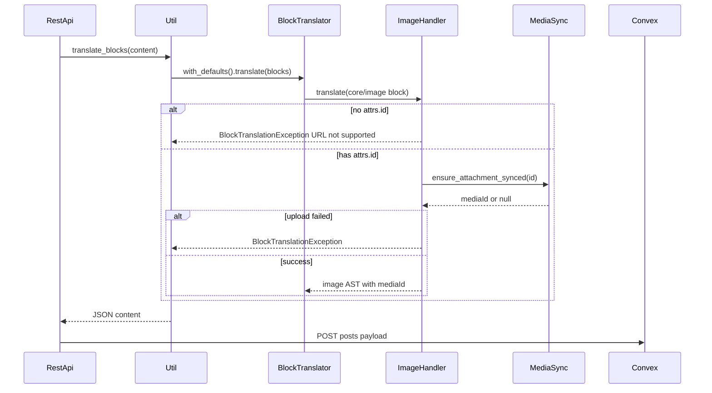

# core/image block handler with post-sync media ensure

## Goal

When a post is sent to Convex, every supported `core/image` in `post_content` must appear in the translated AST with a valid Convex `mediaId`. **Supported** means the block has a WordPress **attachment id** (`attrs.id`)—typically from uploading via the block or choosing from the Media Library. Unsynced library items are uploaded on demand via [`MediaSync::ensure_attachment_synced()`](wp-content/plugins/post-to-convex/includes/MediaSync.php) (same primitive as the featured image in [`RestApi::build_convex_post_fields()`](wp-content/plugins/post-to-convex/includes/RestApi.php) lines 718–725).

**Not supported (for now):** blocks created with **Insert from URL**, which store only `attrs.url` and no `attrs.id`. Gutenberg does not sideload those into the Media Library automatically, and sideloading during post sync would require rewriting `post_content` block JSON back into the saved post—out of scope and fragile. **Post sync fails** with a clear error when such a block is encountered.

**Future direction:** a Convex-side variation of the media endpoints could download remote URLs and create media rows without WordPress rewriting post content.

**User choice:** if a supported block cannot be synced to Convex (missing id path excluded—handled as unsupported URL), **fail the post sync** (do not omit the block or emit `mediaId: null`).



## Supported vs unsupported `core/image` blocks

| Block source                     | `attrs.id` | `attrs.url` | Behavior on post sync                                         |
| -------------------------------- | ---------- | ----------- | ------------------------------------------------------------- |
| Upload / pick from Media Library | present    | optional    | `ensure_attachment_synced(id)` → AST includes `mediaId`       |
| Insert from URL                  | absent     | present     | **Fail** — `BlockTranslationException` with documented reason |
| Broken / zero id                 | absent / 0 | any         | **Fail** — same as URL-only                                   |

**Note:** Uploading a new image through the image block already triggers existing attachment hooks (`add_attachment` / REST upload) and syncs to Convex before post sync; the handler covers **older library picks** without `post_to_convex_media_id`.

## Sample fixture (already in repo)

[`tests/data/sample-image-block-variants.html`](wp-content/plugins/post-to-convex/tests/data/sample-image-block-variants.html) — copied from the block editor “All blocks” image variants. Contains **27** `core/image` blocks (indices `0`–`26`) after flattening via [`BlockHandlerTestSupport::load_blocks_of_type()`](wp-content/plugins/post-to-convex/tests/Support/BlockHandlerTestSupport.php). All blocks use **`id: 767`** and external `src` URLs; `core/heading` section labels are dropped by the loader (same as paragraph sample dropping headings).

**Implementation todo for fixture:** append one **URL-only** block at the end (index `27`) with no `id` and a `url` attr—used only for the exception test (or keep a synthetic in-test block like the paragraph canonicalization guard).

## AST completeness (same policy as paragraph / heading)

**Include everything we can map from Gutenberg attrs** in the translated AST. The Convex renderer decides what to render; the WordPress plugin does not strip “optional” presentation keys for v1.

-   **Always emit** the top-level keys below on every successful translation (use `null` / empty collections when the block has no value — same pattern as `align: null` on [`HeadingHandler`](wp-content/plugins/post-to-convex/includes/BlockHandlers/HeadingHandler.php)).
-   **Do not** emit raw `url` / `src` for the supported path (Convex uses `mediaId` only). URL-only blocks never reach AST construction.
-   Extend [`AbstractBlockHandler`](wp-content/plugins/post-to-convex/includes/BlockHandlers/AbstractBlockHandler.php) only where needed (e.g. `build_duotone_preset()`, `build_border_color()` on `borderColor`, or an image-specific `build_image_colors()` that adds `border` + `duotone` alongside `text` / `background` / `link`).

## Proposed AST shape for `core/image`

```json
{
  "blockName": "core/image",
  "mediaId": "<convex id>",
  "alt": "",
  "caption": [],
  "align": "left" | "center" | "right" | "wide" | "full" | null,
  "className": string | null,
  "sizeSlug": string | null,
  "width": string | null,
  "height": string | null,
  "aspectRatio": string | null,
  "scale": string | null,
  "lightbox": { "enabled": boolean } | null,
  "link": { "destination": string, "url": string | null },
  "colors": {
    "text": Preset | null,
    "background": Preset | null,
    "link": Preset | null,
    "border": Preset | null,
    "duotone": Preset | null
  },
  "spacing": { "padding": SpacingSides | null, "margin": SpacingSides | null },
  "border": {
    "width": string | null,
    "radius": string | null,
    "color": Preset | null
  }
}
```

`Preset` = `{ "token": string | null, "resolved": string | null }`. `border.width` / `border.radius` come from `attrs.style.border` literals when present (indices `16`–`18`).

| Field                  | Source                                             | Sample indices                                                                       |
| ---------------------- | -------------------------------------------------- | ------------------------------------------------------------------------------------ |
| `mediaId`              | `ensure_attachment_synced( attrs.id )`             | all `0`–`26` (stubbed in tests)                                                      |
| `caption`              | `figcaption` via `InlineTreeParser`, or `[]`       | `1`–`6`, `7`–`14`, etc.                                                              |
| `align`                | `attrs.align`                                      | `1`–`5`                                                                              |
| `className`            | `attrs.className` (e.g. `is-style-rounded`)        | `6`, `7`–`14`                                                                        |
| `sizeSlug`             | `attrs.sizeSlug`                                   | throughout                                                                           |
| `width`, `height`      | `attrs.width` / `attrs.height` as strings          | `12`, `15`–`26`                                                                      |
| `aspectRatio`, `scale` | `attrs.aspectRatio`, `attrs.scale`                 | `8`–`14`                                                                             |
| `lightbox`             | `attrs.lightbox` object (`enabled` bool)           | `7` (`true`), `8` (`false`), `15` (`true`)                                           |
| `link`                 | `attrs.linkDestination`, `attrs.href`              | all blocks use `linkDestination: "none"` — assert `destination: "none"`, `url: null` |
| `colors.border`        | `attrs.borderColor` slug                           | `16` (`vivid-red`)                                                                   |
| `colors.duotone`       | `attrs.style.color.duotone` preset token           | `19`–`26` (all eight slugs)                                                          |
| `border.*`             | `attrs.style.border` width / radius / inline color | `16`–`18`                                                                            |

**Convex consumer:** extend the headless `BlockSchema` discriminated union with `ImageBlockSchema` mirroring the keys above (renderer may ignore unused fields).

## Attachment resolution (in `ImageHandler`)

Private `resolve_attachment_id( array $attrs ): int`:

1. Read `(int) ( $attrs['id'] ?? 0 )`.
2. If `<= 0`, throw `BlockTranslationException` explaining that **Insert from URL** / URL-only `core/image` blocks are not supported and the user should upload or pick from the Media Library instead.

Then:

```php
$media_id = $this->media_sync->ensure_attachment_synced( $attachment_id );
if ( ! is_string( $media_id ) || '' === $media_id ) {
    throw new BlockTranslationException( /* use get_sync_block_reason() when helpful */ );
}
```

Reuse [`MediaSync::get_sync_block_reason()`](wp-content/plugins/post-to-convex/includes/MediaSync.php) for clearer errors (unsupported MIME, missing cURL, etc.).

**Out of scope (unchanged):**

-   Automatic re-upload after crop/edit ([readme FAQ](wp-content/plugins/post-to-convex/readme.txt)).
-   Sideloading URL-only images into WordPress or mutating `post_content` during sync.

## Error plumbing

| File                                                                                                                     | Change                                                                                                                               |
| ------------------------------------------------------------------------------------------------------------------------ | ------------------------------------------------------------------------------------------------------------------------------------ |
| New [`includes/BlockTranslationException.php`](wp-content/plugins/post-to-convex/includes/BlockTranslationException.php) | Typed exception with user-facing message                                                                                             |
| [`Util.php`](wp-content/plugins/post-to-convex/includes/Util.php)                                                        | Let `BlockTranslationException` bubble from `translate_blocks()`                                                                     |
| [`RestApi.php`](wp-content/plugins/post-to-convex/includes/RestApi.php)                                                  | Wrap `Util::translate_blocks( $post->post_content )` in try/catch in `build_convex_post_fields()` → `400` REST response with message |

## New `ImageHandler`

-   Path: [`includes/BlockHandlers/ImageHandler.php`](wp-content/plugins/post-to-convex/includes/BlockHandlers/ImageHandler.php)
-   Extends `AbstractBlockHandler` (colors/spacing for border/duotone-related attrs in sample).
-   Constructor: `InlineTreeParser`, `PresetResolver`, `MediaSync`.
-   `translate()`: require `attrs.id` → ensure Convex id → build output array with **every** top-level AST key (null/empty when absent).
-   Helpers: caption from `innerHTML`; `build_link()` from `linkDestination` + `href`; `build_lightbox()`; `build_border()` + extended `colors` for border/duotone presets via `PresetResolver`.

Register in [`BlockTranslator::with_defaults()`](wp-content/plugins/post-to-convex/includes/BlockHandlers/BlockTranslator.php).

## Unit tests (same pattern as paragraph / heading / list)

Mirror [`ParagraphHandlerTest`](wp-content/plugins/post-to-convex/tests/ParagraphHandlerTest.php) and [`BlockHandlerTestSupport`](wp-content/plugins/post-to-convex/tests/Support/BlockHandlerTestSupport.php).

### Test harness

-   **`ImageHandlerTest`** uses the trait’s `load_blocks_of_type( 'sample-image-block-variants.html', 'core/image' )` and private `translate_index( int $index )` (same helpers as paragraph).
-   **`MediaSync` stub:** inject a test double (anonymous subclass or small `StubMediaSync` in test file) where `ensure_attachment_synced( int $id )` always returns `'sample-convex-media-id'` and `get_sync_block_reason()` returns null—so handler tests never hit Convex or cURL.
-   **`PresetResolver` stub:** `make_fake_resolver()` with slugs from the sample, e.g. `'vivid-red' => '#cf2e2e'` for border index `17`; duotone slugs (`dark-grayscale`, `grayscale`, etc.) can resolve to placeholder hex values or null if duotone is token-only.

### Image block indices (flattened `core/image` only)

Section headings (`core/heading`) are omitted by the loader.

| Index     | Section / variant          | Key attrs to assert                                                 |
| --------- | -------------------------- | ------------------------------------------------------------------- |
| `0`       | Default large              | `align` null, empty `caption`, `mediaId` set                        |
| `1`       | Align left                 | `align` `'left'`, caption text “Align left”                         |
| `2`       | Align center               | `align` `'center'`, caption “Center”                                |
| `3`       | Align right                | `align` `'right'`, caption “Align right”                            |
| `4`       | Wide                       | `align` `'wide'`, caption “Wide”                                    |
| `5`       | Full width                 | `align` `'full'`, caption “Full width”                              |
| `6`       | Rounded style              | caption “Rounded variation”, `className` `'is-style-rounded'`       |
| `7`       | Aspect — original          | `lightbox.enabled` true, caption “Original”                         |
| `8`       | 1:1                        | `aspectRatio` `'1'`, `scale` `'cover'`                              |
| `9`       | 4:3                        | `aspectRatio` `'4/3'`                                               |
| `10`      | 3:4                        | `aspectRatio` `'3/4'`                                               |
| `11`      | 3:2                        | `aspectRatio` `'3/2'`                                               |
| `12`      | 2:3 (resized)              | `width` `'840px'`, `height` `'auto'`                                |
| `13`      | 16:9                       | `aspectRatio` `'16/9'`                                              |
| `14`      | 9:16                       | `aspectRatio` `'9/16'`                                              |
| `15`      | Expand on click            | `lightbox` true, `width` `'300px'`, no caption                      |
| `16`      | Border preset              | `borderColor` `vivid-red`, `colors.border`, `border.width`          |
| `17`–`18` | Custom border color/radius | `border.color` resolved hex, `border.radius`                        |
| `19`–`26` | Duotone presets            | `colors.duotone.token` per slug (`dark-grayscale`, … `blue-orange`) |

**Verify during implementation:** `count( load_blocks_of_type( ..., 'core/image' ) )` must be **27** today; **28** after URL-only append. Adjust test index constants if the fixture changes.

### Test methods (grouped by concern)

-   `test_block_name_is_core_image` — index `0`.
-   `test_media_id_populated_from_media_sync` — index `0`, stub returns fixed id.
-   `test_align_null_by_default` — index `0`.
-   `test_align_left_center_right_wide_full` — indices `1`–`5`.
-   `test_caption_parsed_from_figcaption` — indices `1`, `4`, `6` (plain text in inline AST).
-   `test_caption_empty_when_absent` — index `0` or `15`.
-   `test_class_name_rounded_variation` — index `6`.
-   `test_size_slug_present` — spot-check `0`, `8` (`full`), `15` (`large`).
-   `test_width_and_height_string_attrs` — indices `12`, `15`–`18`.
-   `test_aspect_ratio_and_scale` — indices `8`–`14`.
-   `test_lightbox_object` — index `7` (`enabled: true`), `8` (`enabled: false`), `15` (`enabled: true`).
-   `test_link_destination_none` — index `0` (and any index): `link.destination` `'none'`, `url` null.
-   `test_border_color_preset` — index `16` with fake `vivid-red` resolver + `border.width`.
-   `test_custom_border_color_and_radius` — indices `17`, `18`.
-   `test_duotone_tokens_all_presets` — indices `19`–`26` each assert `colors.duotone.token` slug (data provider or loop).
-   `test_ast_includes_all_top_level_keys` — index `0`: assert keys exist even when null (`aspectRatio`, `scale`, `lightbox`, `border`, etc.).
-   `test_rejects_block_without_attachment_id` — index `27` after URL-only block appended **or** synthetic `core/image` block with only `url` in-test.
-   `test_rejects_when_media_sync_returns_null` — synthetic block with `id: 1`, stub MediaSync returns null → `BlockTranslationException`.

### `BlockTranslatorTest`

Add `test_with_defaults_registers_image` (mirror `test_with_defaults_registers_paragraph`): minimal `core/image` with `id` routes through default handler and emits `blockName: 'core/image'`.

Optional: nested `core/group` > `core/image` recursion guard (copy pattern from existing translator test).

### Verification

Per [AGENTS.md](AGENTS.md), from WSL with Docker:

```bash
docker exec -u root -w /var/www/html/wp-content/plugins/post-to-convex wp composer run test -- --filter ImageHandlerTest
docker exec -u root -w /var/www/html/wp-content/plugins/post-to-convex wp composer run test
```

## Documentation (explicit requirement)

Add to [`readme.txt`](wp-content/plugins/post-to-convex/readme.txt):

-   **Features / Media sync:** post sync translates `core/image` blocks with a Media Library attachment id; ensures Convex `mediaId` in content AST.
-   **FAQ:** “Can I use Insert from URL in the image block?” → No for now; reason; workaround; future Convex URL ingestion.

Add to [`includes/BlockHandlers/README.md`](wp-content/plugins/post-to-convex/includes/BlockHandlers/README.md): `ImageHandler` section, sample fixture path, index-driven testing note, supported/unsupported table.

## Manual QA (after implementation)

1. New image via block upload → post to Convex → AST contains `mediaId`.
2. Pick **old library image** without `post_to_convex_media_id` → post sync uploads and AST has `mediaId`.
3. **Insert from URL** → post to Convex → **fails** with clear message.
4. Post with featured image + inline library image → both `featuredImageMediaId` and image block `mediaId` present.

## Files touched (summary)

-   **Existing fixture:** [`tests/data/sample-image-block-variants.html`](wp-content/plugins/post-to-convex/tests/data/sample-image-block-variants.html) (append URL-only block at index `27`)
-   **New:** `ImageHandler.php`, `BlockTranslationException.php`, `ImageHandlerTest.php`
-   **Edit:** `BlockTranslator.php`, `RestApi.php`, `BlockTranslatorTest.php`, `BlockHandlers/README.md`, `readme.txt`
