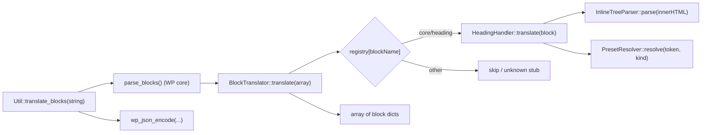
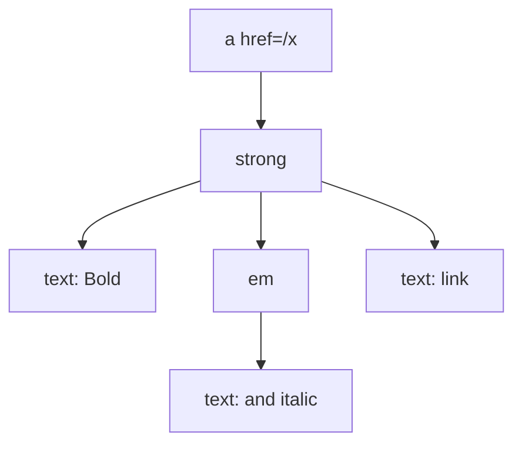

## Goals

1. Replace the inline ad-hoc heading translation in `[Util::translate_blocks](wp-content/plugins/post-to-convex/includes/Util.php)` with a dispatch through a registry of `BlockHandler` implementations.
2. Implement `HeadingHandler` covering every variant in `[sample-heading-block-variants.html](wp-content/plugins/post-to-convex/tests/data/sample-heading-block-variants.html)`.
3. Emit a JSON shape that the Next.js consumer can map 1:1 to React: an inline-AST for text content (`text`, `strong`, `em`, `link`, `mark`) plus structured style metadata where presets carry both `token` and `resolved` values.
4. Cover the handler with PHPUnit tests using the WordPress test harness, driven directly off the sample HTML so each variant is asserted explicitly.

Out of scope (intentionally): paragraph, list, image, etc. The architecture is set up so new handlers slot in by adding one class and registering it.

---

## Architecture



### New files (all under `wp-content/plugins/post-to-convex/includes/BlockHandlers/`)

-   `[BlockHandlerInterface.php](wp-content/plugins/post-to-convex/includes/BlockHandlers/BlockHandlerInterface.php)`
    -   `interface BlockHandlerInterface { public function translate( array $block ): array; }`
-   `[BlockTranslator.php](wp-content/plugins/post-to-convex/includes/BlockHandlers/BlockTranslator.php)`
    -   Holds `array<string, BlockHandlerInterface> $handlers` keyed by block name.
    -   `register(string $blockName, BlockHandlerInterface $handler): void`
    -   `translate(array $blocks): array` -> filters out `null` blockName / unhandled blocks, recursing into `innerBlocks` for handlers that opt into it later.
    -   Default ctor pre-registers `'core/heading' => new HeadingHandler(...)`.
-   `[HeadingHandler.php](wp-content/plugins/post-to-convex/includes/BlockHandlers/HeadingHandler.php)` — described below.
-   `[InlineTreeParser.php](wp-content/plugins/post-to-convex/includes/BlockHandlers/InlineTreeParser.php)`
    -   Takes innerHTML, walks the first element's children with `Dom::string_to_dom_fragment`, returns an array of inline nodes. Reusable for paragraph/list/etc.
-   `[PresetResolver.php](wp-content/plugins/post-to-convex/includes/BlockHandlers/PresetResolver.php)`
    -   Resolves color/font-size/spacing preset slugs using `wp_get_global_settings()`.
    -   Two helpers: `resolve_color(string $slug): ?string` and `resolve_spacing_var(string $token): ?string` (handles `var:preset|spacing|50` and CSS `var( --wp--preset--... )`).

### Updated files

-   `[Util.php](wp-content/plugins/post-to-convex/includes/Util.php)` — `translate_blocks` becomes:
    -   `parse_blocks($content)` -> pass to `BlockTranslator::translate` -> `wp_json_encode`.
    -   Optionally allow injecting a custom translator for testability via a static factory; default constructs the standard one.
-   `[RestApi.php](wp-content/plugins/post-to-convex/includes/RestApi.php)` (both `handle_create_post` and `handle_update_post`) — replace `'content' => $post->post_content` with `'content' => Util::translate_blocks( $post->post_content )`.

PSR-4 note: the sniff in `[phpcs/PostToConvex/Sniffs/Includes/Psr4ClassSniff.php](phpcs/PostToConvex/Sniffs/Includes/Psr4ClassSniff.php)` only enforces top-level files in `includes/` (regex `[^/]+\.php`), so subnamespaced files like `PostToConvex\BlockHandlers\HeadingHandler` in `includes/BlockHandlers/HeadingHandler.php` are PSR-4 compliant via Composer's autoloader and are not flagged by the sniff.

---

## JSON schema for `core/heading`

```json
{
  "blockName": "core/heading",
  "level": 2,
  "align": "wide" | "full" | null,
  "textAlign": "left" | "center" | "right" | null,
  "colors": {
    "text":       { "token": "vivid-red", "resolved": "#cf2e2e" } | null,
    "background": { "token": "pale-cyan-blue", "resolved": "#abb8c3" } | null,
    "link":       { "token": "white" | null, "resolved": "#ffffff" } | null
  },
  "typography": {
    "fontSize":       { "token": "small", "resolved": "13px" } | { "token": null, "resolved": "24px" } | null,
    "fontStyle":      "italic" | null,
    "fontWeight":     "200" | null,
    "lineHeight":     "2.4" | null,
    "letterSpacing":  "7px" | null,
    "textDecoration": "underline" | "line-through" | null,
    "textTransform":  "uppercase" | "lowercase" | "capitalize" | null,
    "writingMode":    "vertical-rl" | null
  },
  "spacing": {
    "padding": { "top": { "token": "50", "resolved": "..." }, "right": ..., "bottom": ..., "left": ... } | null,
    "margin":  { /* same shape */ } | null
  },
  "content": [ /* inline AST, see below */ ]
}
```

### Inline AST node types

-   `{ "type": "text",   "text": "..." }`
-   `{ "type": "strong", "children": [...] }` — also matches `<b>`
-   `{ "type": "em",     "children": [...] }` — also matches `<i>`
-   `{ "type": "link",   "attrs": { "href": "...", "target"?: "...", "rel"?: "..." }, "children": [...] }`
-   `{ "type": "mark",   "attrs": { "style"?: { "backgroundColor": "#6e00ff", "color": "#06eff7" }, "hasInlineColor": true }, "children": [...] }`
-   Unknown inline tags: degrade to their text content (do not silently drop, but flatten to a `text` node) to keep the contract narrow.

### How nesting and position are encoded

The AST is recursive: **sibling order = array order**, **nesting = `children` depth**. There are no character offsets, ranges, or IDs — the renderer walks nodes in order and recurses into `children`. This is the same shape Slate / Lexical / Portable Text use for inline content.

**Canonicalization.** Authoring order in Gutenberg is non-deterministic — applying bold then link then italic produces a different DOM nesting from link then bold then italic, even though the result is visually identical. We canonicalize so that within a uniform run of marks the nesting always follows a fixed precedence order, **outermost first**:

```
link  >  strong  >  em  >  mark  >  text
```

That means all six of these source variants:

```html
<a><strong><em>x</em></strong></a>
<a><em><strong>x</strong></em></a>
<strong><a><em>x</em></a></strong>
<strong><em><a>x</a></em></strong>
<em><a><strong>x</strong></a></em>
<em><strong><a>x</strong></a></em>
```

…all collapse to one canonical AST:

```json
[
	{
		"type": "link",
		"attrs": { "href": "/x" },
		"children": [
			{
				"type": "strong",
				"children": [
					{
						"type": "em",
						"children": [ { "type": "text", "text": "x" } ]
					}
				]
			}
		]
	}
]
```

When marks vary across a run, the canonicalizer still emits the precedence order locally and shares the outer wrapper across adjacent leaves that have it. Examples:

-   `<strong>a<em>b</em>c</strong>` (all three leaves share `strong`, only `b` adds `em`) →

```json
[
	{
		"type": "strong",
		"children": [
			{ "type": "text", "text": "a" },
			{ "type": "em", "children": [ { "type": "text", "text": "b" } ] },
			{ "type": "text", "text": "c" }
		]
	}
]
```

-   `<strong>a</strong>b<strong>c</strong>` (non-contiguous strong runs) → three siblings: `strong([a])`, `text(b)`, `strong([c])`. Adjacent same-mark wrappers are not merged across leaves with a different mark set.

-   Mark instances with different `attrs` are never merged. Two adjacent `<mark>` with different `style` stay as two separate `mark` siblings; same for `<a>` with different `href`s.

Concrete mappings from the sample file:

1. Plain — `<h1>H1 Heading</h1>`

```json
[ { "type": "text", "text": "H1 Heading" } ]
```

2. Whole heading bolded — `<h1><strong>H1 Heading, bold</strong></h1>`

```json
[
	{
		"type": "strong",
		"children": [ { "type": "text", "text": "H1 Heading, bold" } ]
	}
]
```

3. Mixed text + link (the "text, background and link color" sample) — `<h2>H2 Heading with text, background <a href="/">and link color</a></h2>`

```json
[
	{ "type": "text", "text": "H2 Heading with text, background " },
	{
		"type": "link",
		"attrs": { "href": "/" },
		"children": [ { "type": "text", "text": "and link color" } ]
	}
]
```

4. Hypothetical nested formatting — `<a href="/x"><strong>Bold <em>and italic</em> link</strong></a>`

```json
[
	{
		"type": "link",
		"attrs": { "href": "/x" },
		"children": [
			{
				"type": "strong",
				"children": [
					{ "type": "text", "text": "Bold " },
					{
						"type": "em",
						"children": [ { "type": "text", "text": "and italic" } ]
					},
					{ "type": "text", "text": " link" }
				]
			}
		]
	}
]
```

DOM-to-AST shape:



This makes "what text is inside the link" / "what text is inside the bold" trivially answerable: it's the `children` of that node, in order. The Next.js renderer is a single recursive switch:

```ts
function render(node: InlineNode): ReactNode {
  if (node.type === "text") return node.text;
  const children = node.children.map(render);
  switch (node.type) {
    case "strong": return <strong>{children}</strong>;
    case "em":     return <em>{children}</em>;
    case "link":   return <a {...node.attrs}>{children}</a>;
    case "mark":   return <mark style={node.attrs.style}>{children}</mark>;
  }
}
```

**Implementation note — two-pass algorithm in `InlineTreeParser`:** to make canonicalization tractable we don't build the tree directly. Instead:

1. **Pass 1 — collect leaves.** Recursively walk the DOM with an active "mark set" parameter. The set carries entries like `'strong'`, `'em'`, `{ kind: 'link', href, target?, rel? }`, `{ kind: 'mark', style?, hasInlineColor }`. Entering a container element adds its mark to the set; leaving it removes it; encountering an `XML_TEXT_NODE` emits a flat leaf `{ text, marks: <copy of the set> }`. Other elements just recurse without contributing a mark. Result: an ordered flat list of leaves where each leaf carries the union of marks active at that point (order in the set is irrelevant — it's a set keyed by `kind` plus its attrs).
2. **Pass 2 — fold into a canonical tree.** Walk the leaves left to right with a stack of currently-open canonical wrappers. For each leaf, compute the longest common prefix between the current open stack and the leaf's marks ordered by precedence (`link`, `strong`, `em`, `mark`); close any wrappers below that prefix, open the missing ones in precedence order, then emit the leaf's `text` node inside. This is the standard "stack-based merge" used by Markdown/ProseMirror serializers and guarantees that any two leaves sharing a mark + attrs combination are wrapped in the same `<wrapper>` when contiguous.

Two marks are considered the same wrapper iff their `kind` and attrs match by structural equality (so `<a href="/a">` and `<a href="/b">` never merge; `<mark style="color:red">` and `<mark style="color:blue">` never merge).

Pure-whitespace text nodes that sit only at the very start or very end of the heading's child list are dropped (so the indented `\n\t<mark>...\n` sample doesn't produce empty leading/trailing text nodes), but whitespace **between** inline siblings is preserved verbatim and treated as a leaf with an empty mark set.

---

## Consuming the AST in Next.js

This is the contract between the PHP plugin and the headless React frontend. The frontend imports the JSON from Convex, walks it with the renderers below, and produces React elements. The recursive shape means parsing is just a recursive `switch`.

### TypeScript types (mirror of the JSON schema)

```ts
type TextNode = { type: 'text'; text: string };
type StrongNode = { type: 'strong'; children: InlineNode[] };
type EmNode = { type: 'em'; children: InlineNode[] };
type LinkNode = {
	type: 'link';
	attrs: { href: string; target?: string; rel?: string };
	children: InlineNode[];
};
type MarkNode = {
	type: 'mark';
	attrs: {
		style?: { backgroundColor?: string; color?: string };
		hasInlineColor: boolean;
	};
	children: InlineNode[];
};
type InlineNode = TextNode | StrongNode | EmNode | LinkNode | MarkNode;

type Preset = { token: string | null; resolved: string | null };
type SpacingSides = {
	top: Preset | null;
	right: Preset | null;
	bottom: Preset | null;
	left: Preset | null;
};

type HeadingBlock = {
	blockName: 'core/heading';
	level: 1 | 2 | 3 | 4 | 5 | 6;
	align: 'wide' | 'full' | null;
	textAlign: 'left' | 'center' | 'right' | null;
	colors: {
		text: Preset | null;
		background: Preset | null;
		link: Preset | null;
	};
	typography: {
		fontSize: Preset | null;
		fontStyle: string | null;
		fontWeight: string | null;
		lineHeight: string | null;
		letterSpacing: string | null;
		textDecoration: string | null;
		textTransform: string | null;
		writingMode: string | null;
	};
	spacing: {
		padding: SpacingSides | null;
		margin: SpacingSides | null;
	};
	content: InlineNode[];
};
```

### Runtime validation with Zod

The TypeScript types above are erased at runtime, so a malformed payload from Convex (a regression in the plugin, a stale schema, a hand-edited document) would only blow up deep inside the renderer. A Zod schema validates the JSON at the boundary — typically in a Server Component or a tRPC/Route Handler fetcher — and gives you a typed, parsed value or a descriptive error.

Recursive schemas need `z.lazy` plus an explicit `z.ZodType<T>` annotation. We declare the inline node type once, then either keep the manual TypeScript types or replace them with `z.infer<typeof Schema>` for single-source-of-truth.

```ts
import { z } from 'zod';

const PresetSchema = z.object( {
	token: z.string().nullable(),
	resolved: z.string().nullable(),
} );

const SpacingSidesSchema = z.object( {
	top: PresetSchema.nullable(),
	right: PresetSchema.nullable(),
	bottom: PresetSchema.nullable(),
	left: PresetSchema.nullable(),
} );

const TextNodeSchema = z.object( {
	type: z.literal( 'text' ),
	text: z.string(),
} );

const LinkAttrsSchema = z.object( {
	href: z.string(),
	target: z.string().optional(),
	rel: z.string().optional(),
} );

const MarkAttrsSchema = z.object( {
	style: z
		.object( {
			backgroundColor: z.string().optional(),
			color: z.string().optional(),
		} )
		.optional(),
	hasInlineColor: z.boolean(),
} );

// Recursive: declare the TS type, then annotate the schema with z.ZodType<T>.
type InlineNode =
	| { type: 'text'; text: string }
	| { type: 'strong'; children: InlineNode[] }
	| { type: 'em'; children: InlineNode[] }
	| {
			type: 'link';
			attrs: z.infer< typeof LinkAttrsSchema >;
			children: InlineNode[];
	  }
	| {
			type: 'mark';
			attrs: z.infer< typeof MarkAttrsSchema >;
			children: InlineNode[];
	  };

const InlineNodeSchema: z.ZodType< InlineNode > = z.lazy( () =>
	z.discriminatedUnion( 'type', [
		TextNodeSchema,
		z.object( {
			type: z.literal( 'strong' ),
			children: z.array( InlineNodeSchema ),
		} ),
		z.object( {
			type: z.literal( 'em' ),
			children: z.array( InlineNodeSchema ),
		} ),
		z.object( {
			type: z.literal( 'link' ),
			attrs: LinkAttrsSchema,
			children: z.array( InlineNodeSchema ),
		} ),
		z.object( {
			type: z.literal( 'mark' ),
			attrs: MarkAttrsSchema,
			children: z.array( InlineNodeSchema ),
		} ),
	] )
);

export const HeadingBlockSchema = z.object( {
	blockName: z.literal( 'core/heading' ),
	level: z.union( [
		z.literal( 1 ),
		z.literal( 2 ),
		z.literal( 3 ),
		z.literal( 4 ),
		z.literal( 5 ),
		z.literal( 6 ),
	] ),
	align: z.enum( [ 'wide', 'full' ] ).nullable(),
	textAlign: z.enum( [ 'left', 'center', 'right' ] ).nullable(),
	colors: z.object( {
		text: PresetSchema.nullable(),
		background: PresetSchema.nullable(),
		link: PresetSchema.nullable(),
	} ),
	typography: z.object( {
		fontSize: PresetSchema.nullable(),
		fontStyle: z.string().nullable(),
		fontWeight: z.string().nullable(),
		lineHeight: z.string().nullable(),
		letterSpacing: z.string().nullable(),
		textDecoration: z.string().nullable(),
		textTransform: z.string().nullable(),
		writingMode: z.string().nullable(),
	} ),
	spacing: z.object( {
		padding: SpacingSidesSchema.nullable(),
		margin: SpacingSidesSchema.nullable(),
	} ),
	content: z.array( InlineNodeSchema ),
} );

// One block today; this becomes a discriminated union as more handlers are added.
export const BlockSchema = z.discriminatedUnion( 'blockName', [
	HeadingBlockSchema,
] );
export const PostContentSchema = z.array( BlockSchema );

// Single source of truth — replace the manual types above by deriving them.
export type Preset = z.infer< typeof PresetSchema >;
export type SpacingSides = z.infer< typeof SpacingSidesSchema >;
export type HeadingBlock = z.infer< typeof HeadingBlockSchema >;
export type Block = z.infer< typeof BlockSchema >;
export type { InlineNode };
```

Boundary usage — validate once at the fetch layer, throw or render a fallback on failure, and pass the typed value to the renderer:

```ts
async function fetchPostContent(slug: string) {
    const raw = await convex.query(api.posts.getBySlug, { slug });

    // strict — throws ZodError with a precise path on the first invalid node
    const blocks = PostContentSchema.parse(JSON.parse(raw.content));

    return blocks;
}

// or, soft fail with a descriptive log:
const result = PostContentSchema.safeParse(payload);
if (!result.success) {
    console.error("Invalid post content from Convex", result.error.issues);
    return <PostContentFallback />;
}
return <PostContent blocks={result.data} />;
```

Notes:

-   `z.discriminatedUnion("type", ...)` makes invalid payloads fail with a precise path like `content[0].children[1].attrs.href: Required` rather than a generic union mismatch.
-   `BlockSchema` is already a discriminated union on `blockName` so the same pattern extends to `core/paragraph`, `core/list`, etc. without changes to the consumer call site.
-   The plugin emits literals (e.g., `"vivid-red"`) for tokens and the resolved CSS values. The schema accepts any non-null string to keep validation forward-compatible with new theme palettes; tighten with `.regex(...)` only if you want to lock to a specific palette.

### Inline AST renderer (recursive)

The whole renderer is one recursive function plus a thin `<InlineContent>` wrapper. There is no need for offsets, ranges, or a parser — the JSON is already the AST.

```tsx
import type { ReactNode } from 'react';

function renderInline( node: InlineNode, key: number ): ReactNode {
	if ( node.type === 'text' ) return node.text;

	const children = node.children.map( ( child, i ) =>
		renderInline( child, i )
	);

	switch ( node.type ) {
		case 'strong':
			return <strong key={ key }>{ children }</strong>;
		case 'em':
			return <em key={ key }>{ children }</em>;
		case 'link':
			return (
				<a
					key={ key }
					href={ node.attrs.href }
					target={ node.attrs.target }
					rel={ node.attrs.rel }
				>
					{ children }
				</a>
			);
		case 'mark':
			return (
				<mark
					key={ key }
					style={ node.attrs.style }
					className={
						node.attrs.hasInlineColor
							? 'has-inline-color'
							: undefined
					}
				>
					{ children }
				</mark>
			);
	}
}

export function InlineContent( { nodes }: { nodes: InlineNode[] } ) {
	return <>{ nodes.map( ( node, i ) => renderInline( node, i ) ) }</>;
}
```

### Heading block renderer

The heading wrapper carries the level, alignment, color, typography, and spacing metadata; inline content is delegated to `<InlineContent>`. This mirrors the WordPress front-end class names so the same `theme.json` CSS variables apply on the headless side.

```tsx
import type { CSSProperties } from 'react';

export function HeadingBlock( { block }: { block: HeadingBlock } ) {
	const Tag = `h${ block.level }` as 'h1' | 'h2' | 'h3' | 'h4' | 'h5' | 'h6';
	return (
		<Tag
			className={ buildClassName( block ) }
			style={ buildStyle( block ) }
		>
			<InlineContent nodes={ block.content } />
		</Tag>
	);
}

function buildClassName( b: HeadingBlock ): string {
	const cls = [ 'wp-block-heading' ];
	if ( b.align ) cls.push( `align${ b.align }` );
	if ( b.textAlign ) cls.push( `has-text-align-${ b.textAlign }` );
	if ( b.colors.text?.token )
		cls.push( `has-${ b.colors.text.token }-color` );
	if ( b.colors.background?.token )
		cls.push( `has-${ b.colors.background.token }-background-color` );
	if ( b.colors.text ) cls.push( 'has-text-color' );
	if ( b.colors.background ) cls.push( 'has-background' );
	if ( b.colors.link ) cls.push( 'has-link-color' );
	if ( b.typography.fontSize?.token )
		cls.push( `has-${ b.typography.fontSize.token }-font-size` );
	return cls.join( ' ' );
}

function buildStyle( b: HeadingBlock ): CSSProperties {
	const s: CSSProperties = {};
	const t = b.typography;

	// Custom (token-less) font size emits an inline style; preset font sizes are class-based.
	if ( t.fontSize?.resolved && ! t.fontSize.token )
		s.fontSize = t.fontSize.resolved;
	if ( t.fontStyle ) s.fontStyle = t.fontStyle;
	if ( t.fontWeight ) s.fontWeight = t.fontWeight;
	if ( t.lineHeight ) s.lineHeight = t.lineHeight;
	if ( t.letterSpacing ) s.letterSpacing = t.letterSpacing;
	if ( t.textDecoration ) s.textDecoration = t.textDecoration;
	if ( t.textTransform ) s.textTransform = t.textTransform;
	if ( t.writingMode ) ( s as any ).writingMode = t.writingMode;

	applySpacing( s, 'padding', b.spacing.padding );
	applySpacing( s, 'margin', b.spacing.margin );

	return s;
}

function applySpacing(
	s: CSSProperties,
	prop: 'padding' | 'margin',
	sides: SpacingSides | null
) {
	if ( ! sides ) return;
	for ( const side of [ 'top', 'right', 'bottom', 'left' ] as const ) {
		const v = sides[ side ];
		if ( ! v ) continue;
		// Prefer resolved CSS; fall back to a CSS var() for the preset slug.
		const css =
			v.resolved ??
			( v.token ? `var(--wp--preset--spacing--${ v.token })` : null );
		if ( css )
			( s as any )[
				`${ prop }${ side[ 0 ].toUpperCase() }${ side.slice( 1 ) }`
			] = css;
	}
}
```

### Worked example: source -> JSON -> React

Source block (from the sample file):

```html
<!-- wp:heading {"style":{"elements":{"link":{"color":{"text":"var:preset|color|white"}}}},"backgroundColor":"pale-cyan-blue","textColor":"vivid-red"} -->
<h2
	class="wp-block-heading has-vivid-red-color has-pale-cyan-blue-background-color has-text-color has-background has-link-color"
>
	H2 Heading with text, background <a href="/">and link color</a>
</h2>
<!-- /wp:heading -->
```

JSON emitted by the plugin (presets resolved against `theme.json`; unrelated fields elided for brevity):

```json
{
	"blockName": "core/heading",
	"level": 2,
	"align": null,
	"textAlign": null,
	"colors": {
		"text": { "token": "vivid-red", "resolved": "#cf2e2e" },
		"background": { "token": "pale-cyan-blue", "resolved": "#abb8c3" },
		"link": { "token": "white", "resolved": "#ffffff" }
	},
	"typography": {
		"fontSize": null,
		"fontStyle": null,
		"fontWeight": null,
		"lineHeight": null,
		"letterSpacing": null,
		"textDecoration": null,
		"textTransform": null,
		"writingMode": null
	},
	"spacing": { "padding": null, "margin": null },
	"content": [
		{ "type": "text", "text": "H2 Heading with text, background " },
		{
			"type": "link",
			"attrs": { "href": "/" },
			"children": [ { "type": "text", "text": "and link color" } ]
		}
	]
}
```

Rendered with `<HeadingBlock block={json} />`:

```html
<h2
	class="wp-block-heading has-vivid-red-color has-pale-cyan-blue-background-color has-text-color has-background has-link-color"
>
	H2 Heading with text, background <a href="/">and link color</a>
</h2>
```

— equivalent (modulo whitespace) to the original WordPress output, but rendered headlessly.

### Generic AST traversal (parsing for non-rendering purposes)

Because the inline shape is uniform, generic walks are short. Useful when generating excerpts, building tables of contents, sanitizing links, or extracting search-indexable text.

```ts
function* walkInline( nodes: InlineNode[] ): Generator< InlineNode > {
	for ( const node of nodes ) {
		yield node;
		if ( node.type !== 'text' ) yield* walkInline( node.children );
	}
}

export function plainText( nodes: InlineNode[] ): string {
	let out = '';
	for ( const node of walkInline( nodes ) )
		if ( node.type === 'text' ) out += node.text;
	return out;
}

export function collectLinks( nodes: InlineNode[] ): LinkNode[] {
	return [ ...walkInline( nodes ) ].filter(
		( n ): n is LinkNode => n.type === 'link'
	);
}

export function hasFormatting(
	nodes: InlineNode[],
	type: InlineNode[ 'type' ]
): boolean {
	for ( const n of walkInline( nodes ) ) if ( n.type === type ) return true;
	return false;
}
```

Once `paragraph`, `list`, `image`, etc. are added to the PHP side and emit the same inline AST, all of the above renderers and traversal helpers stay unchanged — that is the whole reason the inline format is standardized.

---

## `HeadingHandler::translate` algorithm

Steps over a `core/heading` block array and produces the schema above.

1. **Level** — `intval( $block['attrs']['level'] ?? 2 )`. Defaults to 2 when absent (matches WP default and the `<!-- wp:heading -->` no-attrs variant in the sample).
2. **Align / textAlign** — read `attrs.align` and `attrs.textAlign` directly; fall back to `null`.
3. **Colors** — for each of `attrs.textColor`, `attrs.backgroundColor`, build `{ token, resolved: PresetResolver::resolve_color($slug) }`. For link: read `attrs.style.elements.link.color.text`, parse the `var:preset|color|<slug>` shape into `token` (slug or `null` if it's already a hex) and `resolved` (call resolver with the slug, otherwise return the literal value).
4. **Typography** — read each property from `attrs.style.typography.`:

-   Direct strings: `fontStyle`, `fontWeight`, `lineHeight`, `letterSpacing`, `textDecoration`, `textTransform`, `writingMode`.
-   `fontSize`: prefer `attrs.fontSize` (preset slug -> `{ token, resolved }`) and fall back to `attrs.style.typography.fontSize` (`{ token: null, resolved: "<value>" }`).

1. **Spacing** — for `attrs.style.spacing.padding|margin`, transform each side `{top, right, bottom, left}` into `{ token, resolved }` using `PresetResolver::resolve_spacing_var` to expand `var:preset|spacing|50` into the actual computed CSS value.
2. **Content** — pass `$block['innerHTML']` to `InlineTreeParser::parse` to produce the inline AST. The parser:

-   Loads via `[Dom::string_to_dom_fragment](wp-content/plugins/post-to-convex/includes/Dom.php)`.
-   Finds the heading element (`h1`..`h6`, the first one). All other children at fragment top-level are dropped (Gutenberg always wraps a heading in a single `<hN>`).
-   Walks the heading's `childNodes` and produces nodes:
    -   `XML_TEXT_NODE` -> `{ type: 'text', text: $node->nodeValue }` (preserve whitespace; trim only outermost surrounding whitespace via a final pass that drops leading/trailing pure-whitespace text nodes — this avoids breaking the `\n\t<mark>` indentation seen in the sample).
    -   `<strong>`/`<b>` -> `strong`; `<em>`/`<i>` -> `em`.
    -   `<a>` -> `link`, capture `href`, `target`, `rel` attrs.
    -   `<mark>` -> `mark`, capture `style` parsed via simple `prop: value;` split into `backgroundColor`/`color`, and `hasInlineColor = strpos($class, 'has-inline-color') !== false`.
    -   Any other element: recurse into its children but emit only the children (flatten unknown wrappers).

1. Return the assoc array; `BlockTranslator` aggregates them; `Util::translate_blocks` `wp_json_encode`s.

Snippet sketch (not the final code, just shape):

```php
public function translate( array $block ): array {
    $attrs = $block['attrs'] ?? array();
    $style = $attrs['style']  ?? array();

    return array(
        'blockName'  => 'core/heading',
        'level'      => intval( $attrs['level'] ?? 2 ),
        'align'      => $attrs['align']     ?? null,
        'textAlign'  => $attrs['textAlign'] ?? null,
        'colors'     => $this->build_colors( $attrs ),
        'typography' => $this->build_typography( $attrs ),
        'spacing'    => $this->build_spacing( $style['spacing'] ?? array() ),
        'content'    => $this->inline_parser->parse( $block['innerHTML'] ?? '' ),
    );
}
```

---

## Tests (PHPUnit, WP harness)

All under `wp-content/plugins/post-to-convex/tests/`. The existing test runner picks up `test-*.php`.

-   `[test-inline-tree-parser.php](wp-content/plugins/post-to-convex/tests/test-inline-tree-parser.php)` — pure unit tests of `InlineTreeParser::parse` against snippet strings. Cases:
    -   Plain text only.
    -   `<strong>` / `<b>` / `<em>` / `<i>` (each + a nested combo like `<strong><em>x</em></strong>` to assert nested `children`).
    -   Mixed siblings — `pre <strong>bold</strong> post` produces three nodes in order: text, strong (with one text child), text.
    -   `<a href="/">x</a>` (with and without `target`/`rel`).
    -   Nested link wrapping formatting — `<a href="/x"><strong>Bold <em>and italic</em> link</strong></a>` produces a 3-level tree (link -> strong -> [text, em -> text, text]).
    -   `<mark style="background-color: #6e00ff; color: #06eff7" class="has-inline-color">x</mark>` -> verifies parsed style + `hasInlineColor: true`.
    -   Whitespace-only nodes around a wrapper element (the `\n\t<mark>...</mark>\n` case from the sample) are trimmed at the boundaries but preserved internally (e.g., the space in `text <a>...</a>`).
    -   Unknown tag like `<span>` flattens to its text children.
    -   **Canonicalization — all six bold/italic/link orderings collapse to one AST.** A `@dataProvider` feeds each of the six source variants in the "How nesting and position are encoded" section and asserts every one parses to the canonical `link > strong > em > text` tree. This is the keystone test for the canonicalize-tree decision.
    -   **Canonicalization — partial overlap.** `<strong>a<em>b</em>c</strong>` -> `[strong([text(a), em([text(b)]), text(c)])]` (single shared `strong` wrapper).
    -   **Canonicalization — non-contiguous same-mark runs are not merged across a different-mark sibling.** `<strong>a</strong>b<strong>c</strong>` -> three siblings: `strong([a])`, `text(b)`, `strong([c])`.
    -   **Canonicalization — mark/link attr equality gates merging.** Two adjacent `<mark style="color:red">` runs with the same style merge into one wrapper; two with different `style` stay as two siblings. Same test pattern for `<a>` with same vs. different `href`.
-   `[test-preset-resolver.php](wp-content/plugins/post-to-convex/tests/test-preset-resolver.php)` — drives the resolver with a stubbed `theme.json`/global-settings filter using `add_filter( 'wp_theme_json_data_theme', ... )` (or directly mock via a small protected seam). Cases:
    -   Color slug present in palette resolves to its hex.
    -   Color slug missing returns `null`.
    -   Spacing token `var:preset|spacing|50` resolves to the spacingScale entry with size `50`.
    -   Already-resolved literal values (e.g., `7px`, `#fff`) pass through unchanged.
-   `[test-heading-handler.php](wp-content/plugins/post-to-convex/tests/test-heading-handler.php)` — end-to-end variant tests. Approach: load `[tests/data/sample-heading-block-variants.html](wp-content/plugins/post-to-convex/tests/data/sample-heading-block-variants.html)`, `parse_blocks` it, then assert each block in order against an expected fixture.
    -   One test method per logical group, each asserting the relevant subset of the schema (so failures are localized):
        -   `test_levels_h1_through_h6` — levels 1..6 (and the no-attrs `h2` default).
        -   `test_inline_bold_italic_link_mark` — H1 variants with `<strong>`, `<em>`, `<a>`, `<mark>`.
        -   `test_align_wide_full`.
        -   `test_text_align_left_center_right`.
        -   `test_text_color_only`, `test_text_and_background_color`, `test_text_background_link_color` (the 3 color variants from the sample).
        -   `test_font_size_presets` — small / medium / large / x-large with both `token` and `resolved`.
        -   `test_typography_font_style_and_weight` — italic + 200, italic + 900.
        -   `test_typography_line_height`, `test_typography_letter_spacing`.
        -   `test_typography_text_decoration_underline_and_strikethrough`.
        -   `test_typography_text_transform_upper_lower_capitalize`.
        -   `test_spacing_padding_preset`, `test_spacing_margin_preset`.
        -   `test_writing_mode_vertical_rl` — both vertical headings inside the trailing flex group (these come through `parse_blocks` as `core/group` containing `innerBlocks`; we'll either recurse via `BlockTranslator` or extract them in the test by walking `innerBlocks`).
-   `[test-block-translator.php](wp-content/plugins/post-to-convex/tests/test-block-translator.php)` — registry behavior:
    -   Unknown block names are skipped (not crashing).
    -   Custom handlers can be registered and dispatch correctly.
    -   `Util::translate_blocks` returns valid JSON parseable back into an array equal to the translator's output.

### Test infrastructure

-   Add a small helper in `tests/` (e.g. `tests/Support/HeadingFixtures.php`) that loads the sample HTML once and returns `parse_blocks($content)`; tests pull the block they care about by index. Indexing matches the file order so additions to the sample don't silently break unrelated tests as long as new variants are appended.
-   For preset resolution, register a `wp_theme_json_data_theme` filter in test `setUp` that injects a deterministic palette (e.g., `vivid-red -> #cf2e2e`, `pale-cyan-blue -> #abb8c3`, `white -> #ffffff`, spacing `50 -> 1.25rem`) so assertions on `resolved` are stable regardless of the active theme.

---

## RestApi integration

Update both write handlers to send the translated content:

-   `[RestApi::handle_create_post](wp-content/plugins/post-to-convex/includes/RestApi.php)` — change `'content' => $post->post_content` to `'content' => Util::translate_blocks( $post->post_content )`.
-   `[RestApi::handle_update_post](wp-content/plugins/post-to-convex/includes/RestApi.php)` — same change.

This is the minimal wiring needed to satisfy the goal "the JSON object that gets sent to Convex as the 'content' param".

---

## Verification

Docker is already running and dependencies are already installed; per the AGENTS rule, all `docker` and `bin/*.sh` invocations must go through **Ubuntu WSL**, never PowerShell/CMD. From a WSL shell at the repo root:

```bash
docker exec -u root -w /var/www/html/wp-content/plugins/post-to-convex wp composer run test
```

PHPCS/lint runs separately, also from WSL:

```bash
./bin/php-lint.sh
```

If either command fails (per the AGENTS rule, I'll surface the failure rather than assume success and will pause for your confirmation before continuing).
