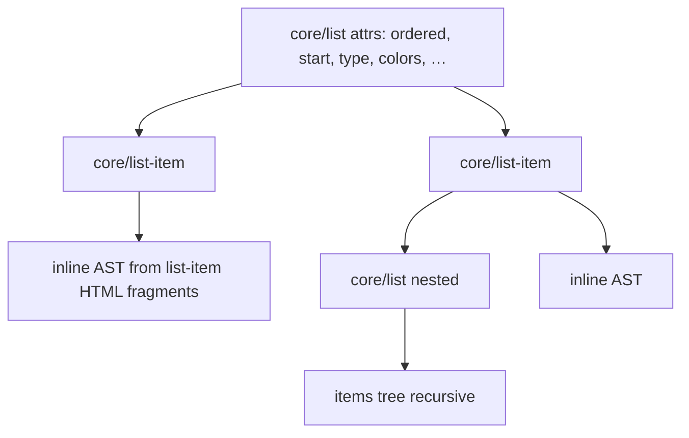
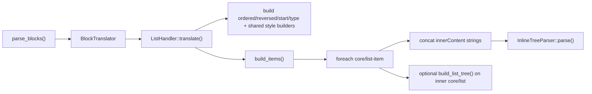

# List block translator plan

## Goal

Implement `ListHandler` for `core/list`, mirroring the heading/paragraph workflow: extend [`AbstractBlockHandler`](wp-content/plugins/post-to-convex/includes/BlockHandlers/AbstractBlockHandler.php), register in [`BlockTranslator::with_defaults()`](wp-content/plugins/post-to-convex/includes/BlockHandlers/BlockTranslator.php), drive tests from [`sample-list-block-variants.html`](wp-content/plugins/post-to-convex/tests/data/sample-list-block-variants.html), and update [`BlockHandlers/README.md`](wp-content/plugins/post-to-convex/includes/BlockHandlers/README.md).

**Out of scope:** `core/list-item` as a standalone registered handler, React/Zod consumer types, wrapper blocks (`core/group`), unordered bullet-style variants (`type: disc` — not in the sample).

## Why lists differ from heading/paragraph

Heading and paragraph are **leaf blocks**: all visible text lives in `innerHTML`, so `InlineTreeParser::parse( $inner_html )` is enough.

Lists are **container blocks**:



-   Top-level list `innerHTML` is only the wrapper (`<ul>` / `<ol>`) — **not** item text.
-   Each `core/list-item` holds item copy (inline HTML) and may contain a nested `core/list` in `innerBlocks`.
-   [`BlockTranslator`](wp-content/plugins/post-to-convex/includes/BlockHandlers/BlockTranslator.php) already stops recursing once a handler matches, so nested lists must be **embedded** in the parent output (they must not appear as separate top-level translated blocks).

The README “Adding a new block handler” snippet that sets `'content' => $this->inline_parser->parse( $inner_html )` on the list block is a placeholder — the real handler uses an `items` array instead.

## JSON schema for `core/list`

```json
{
  "blockName": "core/list",
  "ordered": false,
  "reversed": false,
  "start": null,
  "type": null,
  "colors": { "text": Preset|null, "background": Preset|null, "link": Preset|null },
  "typography": { "fontSize": Preset|null, "fontStyle": ..., "fontWeight": ...,
                   "lineHeight": ..., "letterSpacing": ..., "textDecoration": ...,
                   "textTransform": ..., "writingMode": ... },
  "spacing": { "padding": SpacingSides|null, "margin": SpacingSides|null },
  "items": [
    {
      "content": [ /* inline AST — same node shapes as heading/paragraph */ ],
      "nested": null | {
        "ordered": bool,
        "reversed": bool,
        "start": number | null,
        "type": string | null,
        "items": [ /* same item shape, recursive */ ]
      }
    }
  ]
}
```

### List-specific fields (from Gutenberg `attrs`)

| Schema field | WP source        | Rules                                                                                                                                         |
| ------------ | ---------------- | --------------------------------------------------------------------------------------------------------------------------------------------- |
| `ordered`    | `attrs.ordered`  | `true === ( $attrs['ordered'] ?? false )` (same strictness as paragraph `dropCap`)                                                            |
| `reversed`   | `attrs.reversed` | `true === ( $attrs['reversed'] ?? false )`                                                                                                    |
| `start`      | `attrs.start`    | `null` when absent; otherwise positive `int` (sample: `start: 4`)                                                                             |
| `type`       | `attrs.type`     | `nullable_string()` — sample values: `upper-alpha`, `lower-alpha`, `upper-roman`, `lower-roman`; `null` when absent (browser default decimal) |

Shared `colors` / `typography` / `spacing` reuse inherited builders unchanged (same shape as heading/paragraph).

### Item shape

-   **`content`**: inline AST for the list-item’s **own** text (before any nested list).
-   **`nested`**: optional subtree for the single nested `core/list` allowed inside a list-item (WordPress allows one nested list per item). Built by the same tree builder used at the top level, but **without** repeating `blockName` / colors / typography / spacing on the nested node (nested lists in the sample carry no style attrs; structure only).

### List-item HTML extraction (new pattern)

Do **not** parse the list-item’s full `innerHTML` when it contains a nested list — that would duplicate nested `<li>` text via `InlineTreeParser`’s transparent-element walk.

Concatenate only **string** chunks from `innerContent` (skip `null` placeholders that stand in for inner blocks):

```php
private function list_item_inline_html( array $list_item_block ): string {
    $parts = array();
    foreach ( $list_item_block['innerContent'] ?? array() as $chunk ) {
        if ( is_string( $chunk ) ) {
            $parts[] = $chunk;
        }
    }
    return implode( '', $parts );
}
```

Then `$this->inline_parser->parse( $html )`. Empty items (`<li></li>` in sample index `3`) → `content: []`.

## File-by-file changes

### New: [`includes/BlockHandlers/ListHandler.php`](wp-content/plugins/post-to-convex/includes/BlockHandlers/ListHandler.php)

```php
class ListHandler extends AbstractBlockHandler {

    public function translate( array $block ): array {
        $attrs = /* … */;
        $style = /* … */;

        return array(
            'blockName'  => 'core/list',
            'ordered'    => $this->build_ordered( $attrs ),
            'reversed'   => $this->build_reversed( $attrs ),
            'start'      => $this->build_start( $attrs ),
            'type'       => $this->nullable_string( $attrs['type'] ?? null ),
            'colors'     => $this->build_colors( $attrs, $style ),
            'typography' => $this->build_typography( $attrs, $style ),
            'spacing'    => $this->build_spacing( $style ),
            'items'      => $this->build_items( $block ),
        );
    }

    private function build_items( array $list_block ): array { /* walk innerBlocks */ }
    private function translate_list_item( array $list_item ): array { /* content + nested */ }
    private function build_list_tree( array $list_block ): array { /* ordered/reversed/start/type/items for nested */ }
    // build_ordered, build_reversed, build_start, list_item_inline_html
}
```

**`build_items` algorithm:**

1. Iterate `$list_block['innerBlocks']` in order.
2. Skip blocks whose `blockName` is not `core/list-item`.
3. For each list-item, call `translate_list_item()`:
    - `content` ← `parse( list_item_inline_html( $item ) )`
    - Find first `core/list` in `$item['innerBlocks']` (if any) → `nested` ← `build_list_tree( $nested_list )`, else `nested: null`

### Modified: [`includes/BlockHandlers/BlockTranslator.php`](wp-content/plugins/post-to-convex/includes/BlockHandlers/BlockTranslator.php)

Register in `with_defaults()`:

```php
$instance->register(
    'core/list',
    new ListHandler( new InlineTreeParser(), new PresetResolver() )
);
```

Existing tests that use bare `new BlockTranslator()` are unaffected.

### Modified: [`includes/BlockHandlers/README.md`](wp-content/plugins/post-to-convex/includes/BlockHandlers/README.md)

-   Mermaid flowchart: add `core/list` → `ListHandler`.
-   Files table: add `ListHandler.php` row.
-   `with_defaults()` snippet: register list handler.
-   New section **“How `ListHandler` differs”**: container + `items` / `nested`, `innerContent` string concatenation, list attrs (`ordered`, `reversed`, `start`, `type`).
-   Fix the “Adding a new block handler” example: replace misleading top-level `content` with `items` for lists.
-   Testing notes: mention `ListHandlerTest` + sample file; update `BlockTranslatorTest` bullet to include list registration.

### New: [`tests/ListHandlerTest.php`](wp-content/plugins/post-to-convex/tests/ListHandlerTest.php)

Reuse [`BlockHandlerTestSupport`](wp-content/plugins/post-to-convex/tests/Support/BlockHandlerTestSupport.php) (same fake resolver maps as [`HeadingHandlerTest`](wp-content/plugins/post-to-convex/tests/HeadingHandlerTest.php)):

```php
$palette = array(
    'vivid-red'      => '#cf2e2e',
    'pale-cyan-blue' => '#abb8c3',
    'white'          => '#ffffff',
);
$font_sizes = array( 'small' => '13px', 'medium' => '20px', 'large' => '36px', 'x-large' => '42px' );
$spacing    = array( '50' => '1.25rem' );
```

**Sample indexing:** `load_blocks_of_type( 'sample-list-block-variants.html', 'core/list' )` returns **27 top-level** lists (indices `0`–`26`). Nested `<ul>` / `<ol>` inside list-items are **not** flattened into separate indices because [`flatten_blocks_by_name`](wp-content/plugins/post-to-convex/tests/Support/BlockHandlerTestSupport.php) skips `innerBlocks` after a name match — same behavior that made paragraph-in-group indexing stable.

| Index     | Section in sample            | What to assert                                                                                   |
| --------- | ---------------------------- | ------------------------------------------------------------------------------------------------ |
| `0`       | Unordered plain              | `ordered: false`, 3 items, middle item has 3-level `nested` chain                                |
| `1`       | Unordered + inline           | `strong` / `em` / `link` / `mark` on specific items (deepest nested mark: `#aff6b4` / `#e30000`) |
| `2`       | Ordered plain                | `ordered: true`, defaults otherwise                                                              |
| `3`       | Ordered `start: 4`           | `start === 4`, last item `content: []`                                                           |
| `4`–`7`   | Number styles                | `type` → `upper-alpha`, `lower-alpha`, `upper-roman`, `lower-roman`                              |
| `8`       | Reverse order                | `reversed: true`                                                                                 |
| `9`–`11`  | Color                        | text-only; text+background; link override (`white`) — same assertions style as heading           |
| `12`–`15` | Font size presets            | `typography.fontSize` `{ token, resolved }` per slug                                             |
| `16`–`17` | Appearance                   | `fontStyle` + `fontWeight`                                                                       |
| `18`–`19` | Line height / letter spacing |                                                                                                  |
| `20`–`21` | Decoration                   | underline / line-through                                                                         |
| `22`–`24` | Letter case                  | uppercase / lowercase / capitalize                                                               |
| `25`–`26` | Spacing                      | padding all sides preset `50`; margin all sides preset `50`                                      |

**Suggested test methods** (localized failures, same style as paragraph):

-   `test_block_name_is_core_list`
-   `test_ordered_defaults_to_false` (index `0`)
-   `test_ordered_true` (index `2`)
-   `test_start_value` (index `3`)
-   `test_empty_list_item_content` (index `3`, last item)
-   `test_list_style_types` (indices `4`–`7`)
-   `test_reversed_order` (index `8`)
-   `test_nested_three_level_structure` (index `0` or `1`)
-   `test_inline_formatting_in_items` (index `1` — bold / italic / link / mark leaves)
-   Color / typography / spacing groups (indices from table)
-   `test_inline_content_canonicalization_collapses_all_orderings` — build synthetic `core/list-item` blocks with six link/strong/em orderings in `innerContent` + minimal wrapper strings, run through handler, assert canonical AST on `items[0].content` (parity with heading/paragraph guards)

### Modified: [`tests/BlockTranslatorTest.php`](wp-content/plugins/post-to-convex/tests/BlockTranslatorTest.php)

Add `test_with_defaults_registers_list` mirroring [`test_with_defaults_registers_paragraph`](wp-content/plugins/post-to-convex/tests/BlockTranslatorTest.php): minimal list block comment → decoded `blockName === 'core/list'` and `items` key present.

## Architecture diagram



## Verification

From WSL with Docker running (per [`AGENTS.md`](AGENTS.md)):

```bash
docker exec -u root -w /var/www/html/wp-content/plugins/post-to-convex wp composer run test
./bin/php-lint.sh
```

## Implementation todos

| ID                 | Task                                                                                           |
| ------------------ | ---------------------------------------------------------------------------------------------- |
| `list-handler`     | Implement `ListHandler` with list attrs, `build_items`, `innerContent` extraction, nested tree |
| `register-default` | Register in `BlockTranslator::with_defaults()`                                                 |
| `list-tests`       | Add `ListHandlerTest.php` covering indices 0–26 and canonicalization guard                     |
| `translator-test`  | Add `test_with_defaults_registers_list`                                                        |
| `readme`           | Document list handler, fix list example snippet, update diagrams/tables                        |
| `run-checks`       | Run PHPUnit + PHPCS from WSL                                                                   |
