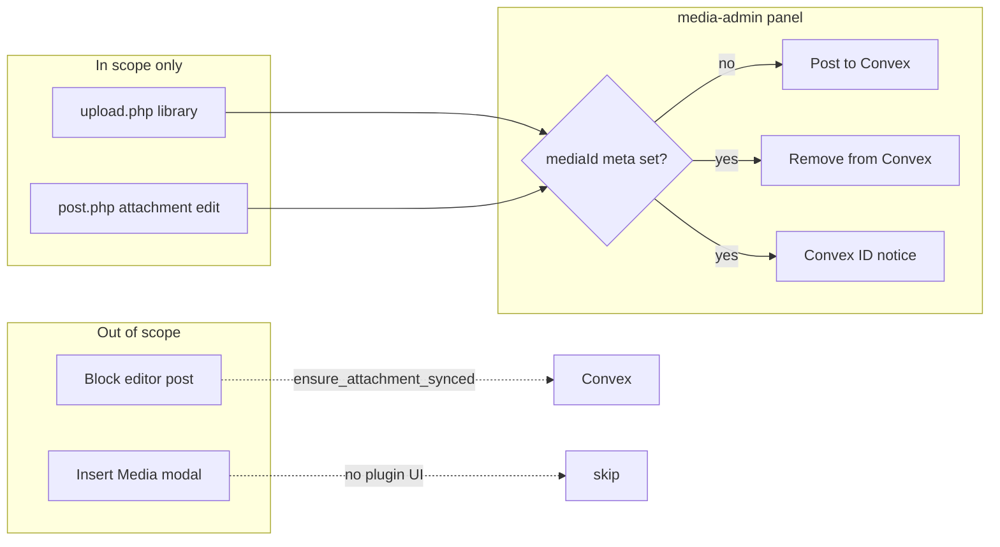

# Media library Convex UI

## Goal

Let editors manually **send** a pre-existing attachment to Convex or **remove** it from Convex **without** deleting the WordPress file, and display the Convex **media ID**, only **outside post editing**:

1. **Media → Library** (`upload.php` grid + attachment details sidebar)
2. **Classic attachment edit** (`post.php` when `post_type === 'attachment'` — attachment post screen, not the block editor)

**Explicitly out of UI scope:**

-   Block editor **Insert Media** modal and any attachment-details UI while editing a post
-   Post-driven sync stays as today: [`RestApi::build_convex_post_fields()`](wp-content/plugins/post-to-convex/includes/RestApi.php) uses `ensure_attachment_synced()` for featured images when syncing a post

Posts control whether an attachment is sent **in the context of that post**; the media library UI is for managing attachments **in isolation** (e.g. pre-plugin library images).

## Button and ID UX (match post sidebar, simplified)

Mirror [`src/editor.tsx`](wp-content/plugins/post-to-convex/src/editor.tsx) **visibility rules** using `post_to_convex_media_id` on the attachment (not post meta):

| `post_to_convex_media_id` | Primary action               | Secondary                          | ID display                                |
| ------------------------- | ---------------------------- | ---------------------------------- | ----------------------------------------- |
| Empty / missing           | **Post to Convex** (primary) | —                                  | Hidden or “Not synced”                    |
| Set                       | —                            | **Remove from Convex** (secondary) | Info `Notice`: **Convex ID:** `{mediaId}` |

**Do not** add **Update in Convex** on media screens — metadata already PATCHes via [`MediaSync`](wp-content/plugins/post-to-convex/includes/MediaSync.php) hooks after library edits.

Mutually exclusive buttons: only one of Send or Remove visible at a time, toggled after successful REST response.



## Backend: MediaSync

In [`MediaSync.php`](wp-content/plugins/post-to-convex/includes/MediaSync.php):

**`sync_attachment_to_convex( int $attachment_id ): array{ success: bool, media_id: ?string, error: ?string }`**

-   Public entry for manual send.
-   If not `can_sync_attachment()` → `success: false` with a clear error.
-   If meta already set → return existing id (idempotent success).
-   Else call existing `upload_attachment()`.

**`detach_attachment_from_convex( int $attachment_id ): array{ success: bool, error: ?string }`**

-   DELETE in Convex; clear `post_to_convex_media_id` only on HTTP success.
-   **Do not** delete the WordPress attachment.
-   Use `$syncing` during detach.

Automatic hooks unchanged.

## Backend: REST routes

Extend [`RestApi.php`](wp-content/plugins/post-to-convex/includes/RestApi.php):

| Route                         | Method   | Body                        | Behavior                                   |
| ----------------------------- | -------- | --------------------------- | ------------------------------------------ |
| `/syncAttachment`             | `PUT`    | `{ "id": <attachment id> }` | `MediaSync::sync_attachment_to_convex`     |
| `/removeAttachmentFromConvex` | `DELETE` | `{ "id": <attachment id> }` | `MediaSync::detach_attachment_from_convex` |

**Permission:** `current_user_can( 'edit_post', $id )` + valid attachment post.

**Responses:** sync returns `{ message, data: { mediaId } }`; detach returns `{ message }`.

Zod schemas in [`src/schemas.ts`](wp-content/plugins/post-to-convex/src/schemas.ts).

## Admin UI: `AttachmentFields`

New [`includes/AttachmentFields.php`](wp-content/plugins/post-to-convex/includes/AttachmentFields.php), booted from [`Plugin.php`](wp-content/plugins/post-to-convex/includes/Plugin.php).

### Screen gating (critical)

**Enqueue `media-admin` script only on:**

-   `upload.php` (Media Library)
-   `post.php` when editing an **attachment** post (`$post->post_type === 'attachment'`)

**Do not enqueue on:**

-   `enqueue_block_editor_assets`
-   `post.php` / `post-new.php` for regular posts (avoids Insert Media modal)

**`attachment_fields_to_edit` filter:** add Convex panel only when the current admin screen is:

-   `upload` (`$screen->id === 'upload'`), or
-   attachment post edit (`$screen->base === 'post' && $screen->post_type === 'attachment'`)

Otherwise return `$fields` unchanged (skips Insert Media modal compat markup on post edit screens and unrelated AJAX compat calls).

### Panel markup

Compat HTML + shared React mount point (`post-to-convex-media-panel`):

-   Description (supported image types; link to settings if misconfigured)
-   React root for buttons/notices (grid + classic edit)
-   Initial `data-media-id` from PHP for first paint optional; JS refreshes from REST meta after actions

### `media-admin.tsx`

Webpack entry in [`webpack.config.js`](wp-content/plugins/post-to-convex/webpack.config.js) → `build/media-admin.js`.

-   Bind to panel(s) on page; on library grid, re-bind when selection changes (`wp.media` frame / selection events).
-   Read `post_to_convex_media_id` via `GET /wp/v2/media/{id}?context=edit` meta (`AttachmentMeta::MEDIA_ID_META_KEY`).
-   Render per table above: `Button` + `Notice` from `@wordpress/components`, strings aligned with editor (`Post to Convex`, `Remove from Convex`, `Convex ID:`).
-   `PUT /post-to-convex/v1/syncAttachment` / `DELETE /post-to-convex/v1/removeAttachmentFromConvex` via `apiFetch`.

Localize `postToConvexMediaAdmin` (`mediaIdMetaKey`, `scriptDebug`).

## Consistency matrix

| Surface                           | Convex attachment UI                        |
| --------------------------------- | ------------------------------------------- |
| Block editor post sidebar         | Post create/update/remove (unchanged)       |
| Block editor Insert Media         | **None**                                    |
| Media Library (`upload.php`)      | Send **or** Remove + ID                     |
| Attachment post edit (`post.php`) | Send **or** Remove + ID                     |
| Featured image on post sync       | `ensure_attachment_synced` only (unchanged) |

## Tests

-   `MediaSyncTest`: detach clears meta on mocked DELETE success; sync errors for unsupported MIME.
-   `AttachmentFieldsTest`: filter adds field on `upload` screen context; filter skips when screen is `post` + `post` post type (simulate with screen mock or helper).

**Run PHPUnit in Docker via WSL** (this repo targets Docker Engine in Ubuntu WSL, not PowerShell-native Docker). From Windows, use a WSL shell or `wsl -e bash -c "..."` with containers already up (`docker compose up -d` in WSL):

```bash
docker exec -u root -w /var/www/html/wp-content/plugins/post-to-convex wp composer run test
```

Optional filter after implementation:

```bash
docker exec -u root -w /var/www/html/wp-content/plugins/post-to-convex wp composer run test -- --filter 'MediaSyncTest|AttachmentFieldsTest'
```

See [README.md](README.md) for full install/test setup (`install-wp-tests.sh`, `composer install` in the `wp` container). Build JS assets with **`pnpm run build`** from `wp-content/plugins/post-to-convex` (pnpm workspace at repo root).

## Docs

[`readme.txt`](wp-content/plugins/post-to-convex/readme.txt): manual send/remove in Media Library only; block editor media modal unchanged; new REST routes.

## Manual QA

1. Pre-plugin JPEG in library → **Post to Convex** only → meta set → **Remove from Convex** + ID notice.
2. Remove → meta cleared; file remains in library.
3. Open post in block editor → Insert Media → attachment details → **no** Post to Convex panel.
4. Sync post with featured image → still uploads via post sync without using library buttons.
5. `post.php?post={attachment_id}&action=edit` → same Send/Remove behavior.
6. PDF → Send disabled with clear message.

## Out of scope

-   Block editor / Insert Media modal UI.
-   **Update in Convex** button on media screens.
-   Block-level image alt.
-   Bulk sync.
-   Re-upload on send.
