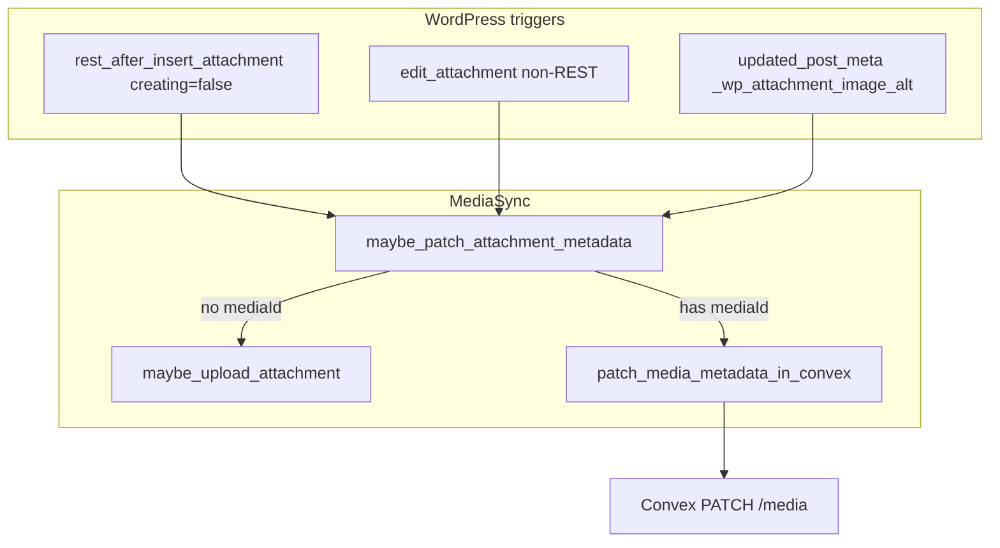

# Media metadata PATCH sync

## Goal

When a synced image attachment’s **alt**, **title**, **caption**, or **description** changes in WordPress, send a **PATCH** to `{cloud_url}/api/postToConvex/v1/media` with JSON `{ mediaId, alt, title, caption, description }` (all required strings; use `""` when empty). Only update Convex metadata; do not re-upload the file.

## Current baseline

[`MediaSync`](wp-content/plugins/post-to-convex/includes/MediaSync.php) already:

-   Maps WP fields via `get_attachment_form_fields()` → `alt` (`_wp_attachment_image_alt`), `title`, `caption`, `description`
-   **PUT** upload (cURL) on create: `add_attachment`, `rest_after_insert_attachment` (`$creating === true`), `set_post_thumbnail`
-   **DELETE** (JSON via `wp_remote_request`) on `delete_attachment`
-   Stores `post_to_convex_media_id` on the attachment

**Gap:** `rest_after_insert_attachment` returns early when `! $creating`, and there is no hook for metadata-only edits after upload.



## Implementation

### 1. PATCH client (mirror delete)

Add a private method `patch_media_metadata_in_convex( string $media_id, array $fields ): void` in [`MediaSync.php`](wp-content/plugins/post-to-convex/includes/MediaSync.php):

-   **Method:** `PATCH`
-   **URL:** `$config['url'] . self::MEDIA_API_PATH` (same constant as PUT/DELETE)
-   **Headers:** `Authorization: Bearer …`, `Content-Type: application/json`
-   **Body:** `wp_json_encode( array_merge( array( 'mediaId' => $media_id ), $fields ) )` where `$fields` is exactly `alt`, `title`, `caption`, `description`
-   **Success:** HTTP `200` and JSON `mediaId` present (log-only on failure, same style as `delete_media_in_convex`)
-   **Transport:** `wp_remote_request` only (small JSON body; no cURL needed)

Add a **public** helper for tests and a single source of truth for the contract:

```php
public function build_media_metadata_patch_body( \WP_Post $attachment, string $media_id ): array
```

-   Merge `mediaId` with `get_attachment_form_fields( $attachment )`
-   Coerce every value to string (already done in `get_attachment_form_fields`; keep explicit for PATCH so empty meta becomes `""`, not omitted)

Unlike multipart PUT, **do not omit empty fields** on PATCH — Convex requires all five strings.

### 2. Orchestration: `maybe_patch_attachment_metadata`

Private entry point used by all hooks:

| Check                          | Behavior                                                                                                      |
| ------------------------------ | ------------------------------------------------------------------------------------------------------------- |
| `$this->syncing`               | Return (avoid re-entry during upload/delete/patch)                                                            |
| `! can_sync_attachment( $id )` | Return                                                                                                        |
| No API config                  | Return                                                                                                        |
| No `post_to_convex_media_id`   | Call existing `maybe_upload_attachment( $id )` and return (PUT already carries metadata; no PATCH without id) |
| Otherwise                      | Set `$syncing`, load `WP_Post`, build body, PATCH, clear `$syncing` in `finally`                              |

Do **not** PATCH immediately after a successful upload in the same code path (upload already sent metadata on PUT). Hooks that run only on **updates** satisfy this naturally.

### 3. WordPress hooks (block editor + media library + classic)

Register in `MediaSync::init()`:

**A. REST updates (block editor, modern media library, REST alt/title/caption/description)**

Extend existing handler [`handle_rest_after_insert_attachment`](wp-content/plugins/post-to-convex/includes/MediaSync.php):

```php
if ( $creating ) {
    $this->maybe_upload_attachment( (int) $attachment->ID );
    return;
}
$this->maybe_patch_attachment_metadata( (int) $attachment->ID );
```

**B. Classic attachment edit screen (non-REST)**

```php
add_action( 'edit_attachment', array( $self, 'handle_edit_attachment' ), 10, 1 );
```

Handler calls `maybe_patch_attachment_metadata` only when **not** a REST request:

```php
if ( defined( 'REST_REQUEST' ) && REST_REQUEST ) {
    return;
}
```

This avoids double PATCH when REST updates also fire `edit_attachment`.

**C. Alt-only meta updates (safety net)**

```php
add_action( 'updated_post_meta', array( $self, 'handle_updated_attachment_alt_meta' ), 10, 4 );
```

-   Proceed only if `$meta_key === '_wp_attachment_image_alt'`
-   Resolve `$object_id` as attachment ID; verify `attachment` post type and `can_sync_attachment`
-   Call `maybe_patch_attachment_metadata`

Covers flows that update alt without a full attachment post save.

### 4. Docs and class comment

Update [`readme.txt`](wp-content/plugins/post-to-convex/readme.txt) Convex backend media section:

-   **Update metadata** — `PATCH` with JSON `{ "mediaId", "alt", "title", "caption", "description" }` (all required strings; via `wp_remote_request`)
-   Note automatic sync on attachment edits (media library / block editor)
-   Extend `MediaSync` bullet in PHP components: uploads, metadata PATCH, deletes

Update the class docblock in `MediaSync.php` to mention PATCH alongside PUT/DELETE.

### 5. Tests

Extend [`MediaSyncTest.php`](wp-content/plugins/post-to-convex/tests/MediaSyncTest.php):

-   `test_build_media_metadata_patch_body_includes_media_id_and_all_fields` — assert keys and values, including empty strings when meta/post fields are empty
-   Optionally assert patch body keys are exactly the five required fields (order not important)

No HTTP integration test in PHPUnit (same as delete); behavior verified manually in Docker/WSL as before.

### 6. Manual test plan (after implementation)

1. Upload image via media library → confirm `post_to_convex_media_id` set (existing flow).
2. Edit title/caption/description/alt in **media library** attachment details → Convex row metadata updates (network tab or Convex dashboard).
3. Edit alt on an **Image block** in Gutenberg → PATCH fires via REST.
4. Classic **upload.php** attachment edit (if available) → PATCH via `edit_attachment`.
5. Attachment **without** Convex id: editing metadata triggers upload (PUT), not PATCH.
6. Delete attachment → DELETE still works; no PATCH after delete.

## Files to touch

| File                                                                                   | Change                                                                            |
| -------------------------------------------------------------------------------------- | --------------------------------------------------------------------------------- |
| [`includes/MediaSync.php`](wp-content/plugins/post-to-convex/includes/MediaSync.php)   | PATCH method, patch body builder, `maybe_patch`, three hooks / handler extensions |
| [`tests/MediaSyncTest.php`](wp-content/plugins/post-to-convex/tests/MediaSyncTest.php) | Patch body unit test                                                              |
| [`readme.txt`](wp-content/plugins/post-to-convex/readme.txt)                           | PATCH endpoint documentation                                                      |

No changes to [`Plugin.php`](wp-content/plugins/post-to-convex/includes/Plugin.php), [`RestApi.php`](wp-content/plugins/post-to-convex/includes/RestApi.php), or [`AttachmentMeta.php`](wp-content/plugins/post-to-convex/includes/AttachmentMeta.php) unless you later want REST-exposed patch triggers from the plugin’s own routes (not required for this task).

## Out of scope

-   Re-uploading/replacing attachment files (storageId unchanged on Convex; file replacement in WP is a separate product decision).
-   Syncing non-image attachments or unsupported MIME types (unchanged allowlist).
-   Convex-side schema implementation (already deployed per your contract).
