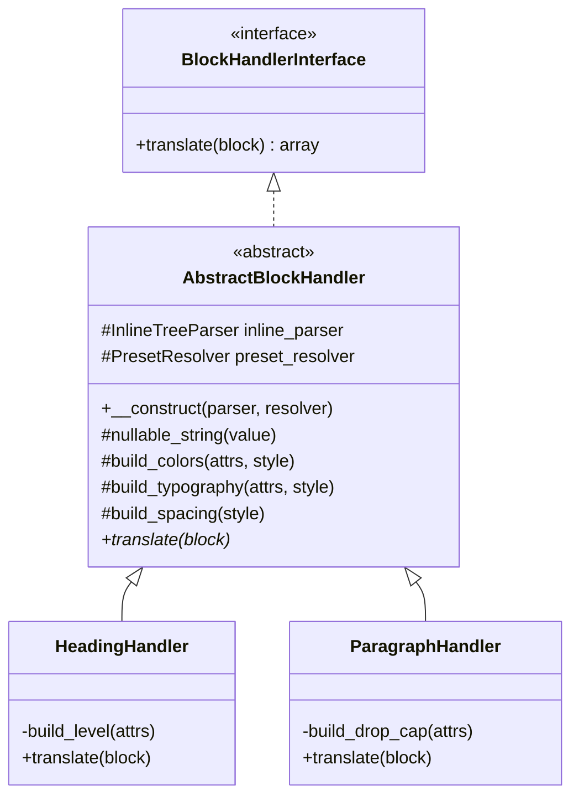

## Goal

Implement `ParagraphHandler` mirroring the existing `HeadingHandler` flow. Instead of duplicating the colors/typography/spacing/inline-content builders, **lift them into an `AbstractBlockHandler` base class** and have both handlers extend it. Paragraph adds two block-specific concerns: `dropCap` (boolean) and a `textAlign` mapped from `attrs.align` (`left | center | right`).

Out of scope: changing the heading JSON shape, refactoring `InlineTreeParser` / `PresetResolver`, or wiring new wrapper-block handlers.

## Schema for `core/paragraph`

```json
{
	"blockName": "core/paragraph",
	"dropCap": false,
	"textAlign": "left" | "center" | "right" | null,
	"colors":     { "text": Preset|null, "background": Preset|null, "link": Preset|null },
	"typography": { "fontSize": Preset|null, "fontStyle": ..., "fontWeight": ..., "lineHeight": ..., "letterSpacing": ..., "textDecoration": ..., "textTransform": ..., "writingMode": ... },
	"spacing":    { "padding": SpacingSides|null, "margin": SpacingSides|null },
	"content":    [ /* inline AST, identical shape to heading */ ]
}
```

Differences vs `core/heading`:

-   No `level`; no block-level `align` (paragraphs don't have `wide`/`full`).
-   Adds `dropCap: bool` from `attrs.dropCap` (defaults to `false`).
-   `attrs.align` (`left|center|right`) is mapped to schema field `textAlign` — same semantics as heading's `textAlign`, so the React renderer can keep a single `has-text-align-*` codepath.

All other fields (`colors`, `typography`, `spacing`, `content`) are byte-for-byte the same shape as heading.

## Architecture: shared base class

Today `HeadingHandler` owns ~270 lines of builders that are entirely block-agnostic: `nullable_string()`, `build_colors()` + `build_color_preset()` + `build_link_color()`, `build_typography()` + `build_font_size()`, `build_spacing()` + `build_spacing_sides()` + `build_spacing_side()`, plus the constructor that takes `InlineTreeParser` + `PresetResolver`.

Extract those into a new abstract parent so paragraph (and future handlers like `core/list`, `core/quote`) reuse them without copy-paste.



The base class implements `BlockHandlerInterface` and leaves `translate()` abstract — every subclass must compose its own output shape from the shared protected builders.

## File-by-file changes

### New: [includes/BlockHandlers/AbstractBlockHandler.php](wp-content/plugins/post-to-convex/includes/BlockHandlers/AbstractBlockHandler.php)

-   `abstract class AbstractBlockHandler implements BlockHandlerInterface`.
-   Protected `$inline_parser` and `$preset_resolver` properties, the constructor (identical to today's heading constructor), and the protected builders moved verbatim from `HeadingHandler`:
    -   `nullable_string()`
    -   `build_colors()`, `build_color_preset()`, `build_link_color()`
    -   `build_typography()`, `build_font_size()`
    -   `build_spacing()`, `build_spacing_sides()`, `build_spacing_side()`
-   `abstract public function translate( array $block ): array;`

### Modified: [includes/BlockHandlers/HeadingHandler.php](wp-content/plugins/post-to-convex/includes/BlockHandlers/HeadingHandler.php)

-   `class HeadingHandler extends AbstractBlockHandler` (drops `implements BlockHandlerInterface` — inherited).
-   Remove the moved methods + constructor + properties.
-   Keep `DEFAULT_LEVEL`, `build_level()`, and `translate()`. `translate()` body is unchanged — it already calls the protected builders by the same names.

### New: [includes/BlockHandlers/ParagraphHandler.php](wp-content/plugins/post-to-convex/includes/BlockHandlers/ParagraphHandler.php)

```php
class ParagraphHandler extends AbstractBlockHandler {

    public function translate( array $block ): array {
        $attrs      = is_array( $block['attrs'] ?? null ) ? $block['attrs'] : array();
        $style      = is_array( $attrs['style'] ?? null ) ? $attrs['style'] : array();
        $inner_html = is_string( $block['innerHTML'] ?? null ) ? $block['innerHTML'] : '';

        return array(
            'blockName'  => 'core/paragraph',
            'dropCap'    => $this->build_drop_cap( $attrs ),
            'textAlign'  => $this->nullable_string( $attrs['align'] ?? null ),
            'colors'     => $this->build_colors( $attrs, $style ),
            'typography' => $this->build_typography( $attrs, $style ),
            'spacing'    => $this->build_spacing( $style ),
            'content'    => $this->inline_parser->parse( $inner_html ),
        );
    }

    private function build_drop_cap( array $attrs ): bool {
        return true === ( $attrs['dropCap'] ?? false );
    }
}
```

### Modified: [includes/BlockHandlers/BlockTranslator.php](wp-content/plugins/post-to-convex/includes/BlockHandlers/BlockTranslator.php)

Register the new handler inside `with_defaults()`:

```php
$instance->register(
    'core/paragraph',
    new ParagraphHandler( new InlineTreeParser(), new PresetResolver() )
);
```

(Existing `BlockTranslatorTest::test_unknown_blocks_are_skipped` and `test_inner_blocks_are_recursed` use bare `new BlockTranslator()` and register only `core/heading`, so this default-registration change does not break them.)

### Modified: [includes/BlockHandlers/README.md](wp-content/plugins/post-to-convex/includes/BlockHandlers/README.md)

-   Add `AbstractBlockHandler.php` and `ParagraphHandler.php` rows to the "Files in this directory" table.
-   Update the "Adding a new block handler" section to show inheriting from `AbstractBlockHandler` (the snippet today implements the interface directly).
-   Brief paragraph-specific notes: `dropCap` mapping, paragraph's `attrs.align` mapping to schema `textAlign`.

## Test plan

### New: [tests/Support/BlockHandlerTestSupport.php](wp-content/plugins/post-to-convex/tests/Support/BlockHandlerTestSupport.php)

Trait (`namespace PostToConvex\Tests\Support;`) that bundles the patterns currently inlined in `HeadingHandlerTest`:

-   `make_fake_resolver( array $palette, array $font_sizes, array $spacing ): PresetResolver` — returns an anonymous subclass of `PresetResolver` whose `resolve_color`/`resolve_font_size`/`resolve_spacing` look up the provided maps. Replaces the heading test's hard-coded anonymous class.
-   `load_blocks_of_type( string $sample_filename, string $block_name ): array` — reads `tests/data/<filename>`, runs `parse_blocks()`, and recursively flattens, keeping only blocks where `blockName === $block_name`. Replaces the heading test's `sample_blocks()` + `flatten_heading_blocks()` pair, parameterized by block name.

PHPUnit autodiscovery (`<directory suffix="Test.php">./tests/</directory>` in [phpunit.xml.dist](wp-content/plugins/post-to-convex/phpunit.xml.dist)) ignores non-`*Test.php` files, so this support file won't run as a test case. Composer's `autoload-dev` PSR-4 (`PostToConvex\\Tests\\ => tests/`) already covers `PostToConvex\Tests\Support\` mapping to `tests/Support/`.

### New: [tests/ParagraphHandlerTest.php](wp-content/plugins/post-to-convex/tests/ParagraphHandlerTest.php)

Mirrors `HeadingHandlerTest`'s structure. Uses `BlockHandlerTestSupport`. Fake palette covers the slugs in [sample-paragraph-block-variants.html](wp-content/plugins/post-to-convex/tests/data/sample-paragraph-block-variants.html):

```php
$palette = array(
    'luminous-vivid-orange' => '#ff6900',
    'vivid-green-cyan'      => '#00d084',
    'pale-cyan-blue'        => '#abb8c3',
);
$font_sizes = array( 'small' => '13px', 'medium' => '20px', 'large' => '36px', 'x-large' => '42px' );
$spacing    = array( '50' => '1.25rem' );
```

Paragraph indices (after flattening to `core/paragraph` only; the lone `core/heading` "Typography" in the sample is dropped by the loader):

-   `0` plain → `1` dropCap → `2` bold → `3` italic → `4` linked → `5` highlighted
-   `6` textColor only → `7` textColor + link override → `8` text+background → `9` text+background+link
-   `10` no align → `11` align left → `12` align center → `13` align right
-   `14`/`15` vertical paragraphs nested in `core/group` — `align:left` then `align:right`, both with `writingMode: vertical-rl`
-   `16`-`19` font sizes small / medium / large / x-large
-   `20` italic + 200, `21` italic + 900
-   `22` lineHeight 2.4, `23` letterSpacing 7px
-   `24` textDecoration underline, `25` line-through
-   `26`-`28` textTransform uppercase / lowercase / capitalize
-   `29` padding preset, `30` margin preset

Test methods (one per concern, so failures stay localized):

-   `test_block_name_is_core_paragraph` — `blockName === 'core/paragraph'` on a plain sample.
-   `test_drop_cap_defaults_to_false` — index 0.
-   `test_drop_cap_true_when_attribute_set` — index 1.
-   `test_drop_cap_paragraph_inline_content_is_parsed` — index 1's mixed `text / strong / text` AST (also documents whitespace preservation around the inline `<strong>`).
-   `test_inline_bold_italic_link_mark` — indices 2-5, same canonical-AST assertions style as the heading test.
-   `test_text_align_null_when_missing` — index 10.
-   `test_text_align_left_center_right` — indices 11-13 → `'left'`, `'center'`, `'right'`.
-   `test_color_text_only` — index 6: `text` resolves, `background` is null, `link` resolves to same slug as text.
-   `test_color_text_with_link_override` — index 7: link slug differs from text slug.
-   `test_color_text_and_background` — index 8.
-   `test_color_text_background_and_link_override` — index 9.
-   `test_font_size_presets` — indices 16-19, asserts `{ token, resolved }` per size.
-   `test_typography_font_style_and_weight` — indices 20, 21.
-   `test_typography_line_height_and_letter_spacing` — indices 22, 23.
-   `test_typography_text_decoration` — indices 24, 25.
-   `test_typography_text_transform` — indices 26-28.
-   `test_spacing_padding_preset` — index 29 (all sides `{ token: '50', resolved: '1.25rem' }`, `margin` null).
-   `test_spacing_margin_preset` — index 30 (symmetric to padding).
-   `test_writing_mode_vertical_rl` — indices 14, 15: both have `typography.writingMode === 'vertical-rl'`; index 14 has `textAlign === 'left'` and index 15 has `textAlign === 'right'`.
-   `test_inline_content_canonicalization_collapses_all_orderings` — integration guard for the canonical-AST rule. Uses a `@dataProvider` (`provide_link_strong_em_orderings`) carrying the same six DOM orderings as [InlineTreeParserTest::provide_link_strong_em_orderings](wp-content/plugins/post-to-convex/tests/InlineTreeParserTest.php) (`<a><strong><em>x</em></strong></a>`, `<a><em><strong>x</strong></em></a>`, … all six permutations of `link`/`strong`/`em` around an "x" text leaf). For each ordering, build a synthetic paragraph block in-test:

```php
  $block = array(
      'blockName' => 'core/paragraph',
      'attrs'     => array(),
      'innerHTML' => '<p>' . $ordering_html . '</p>',
      'innerBlocks' => array(),
  );


```

Run it through `$this->handler->translate( $block )` and assert that `$result['content']` is exactly the canonical `link > strong > em > text` tree (the same expected fixture as the parser test). This proves the canonicalization survives the handler-level wiring for paragraph specifically, complementing the parser-level test which exercises the algorithm in isolation.

### Modified: [tests/HeadingHandlerTest.php](wp-content/plugins/post-to-convex/tests/HeadingHandlerTest.php)

Two changes:

1. **Refactor** to use `BlockHandlerTestSupport` — replace the inline `make_fake_resolver()`, `sample_blocks()`, and `flatten_heading_blocks()` with calls into the shared trait. **Behavior-preserving:** every existing assertion still runs unchanged; only the helper plumbing moves.
2. **Add** the same canonicalization guard as the paragraph test, for symmetry: `test_inline_content_canonicalization_collapses_all_orderings`. Uses a `@dataProvider` carrying the six `link`/`strong`/`em` orderings (shared method or duplicated from the paragraph test — the data is small enough that duplicating keeps each test self-documenting). For each ordering, build a synthetic `core/heading` block (`'innerHTML' => '<h2>' . $ordering . '</h2>'`), run it through `$this->handler->translate( $block )`, and assert `$result['content']` is the canonical `link > strong > em > text` tree.

### Update: [tests/BlockTranslatorTest.php](wp-content/plugins/post-to-convex/tests/BlockTranslatorTest.php)

Add a small `test_with_defaults_registers_paragraph` mirroring the existing `test_with_defaults_registers_heading`, asserting that a `core/paragraph` block routes through the default-registered handler and emits `blockName: 'core/paragraph'`.

## Verification

Per [AGENTS.md](AGENTS.md), all `docker` / `bin/*.sh` invocations go through Ubuntu WSL. From the repo root in WSL with containers already running:

```bash
docker exec -u root -w /var/www/html/wp-content/plugins/post-to-convex wp composer run test
./bin/php-lint.sh
```

If either fails, surface the failure and pause for confirmation before proceeding (per the AGENTS rule).
