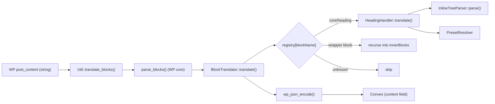

# Block Handlers

This directory translates Gutenberg blocks (as returned by WordPress core's `[parse_blocks()](https://developer.wordpress.org/reference/functions/parse_blocks/)`) into a structured JSON shape that a headless React renderer consumes to render React components.

The translated JSON is what `RestApi::handle_create_post` / `handle_update_post` send to Convex under the `content` field — see `[includes/RestApi.php](../RestApi.php)`.

## High-level flow



The entry point is `[Util::translate_blocks()](../Util.php)`, which parses the post content, hands the parsed block list to a `BlockTranslator` pre-loaded with the default handlers (`BlockTranslator::with_defaults()`), and JSON-encodes the result.

## Files in this directory

| File                                                     | Purpose                                                                                                                                                                            |
| -------------------------------------------------------- | ---------------------------------------------------------------------------------------------------------------------------------------------------------------------------------- |
| `[BlockHandlerInterface.php](BlockHandlerInterface.php)` | One-method contract every block handler implements: `translate(array $block): array`.                                                                                              |
| `[BlockTranslator.php](BlockTranslator.php)`             | Registry that maps block names to handlers, dispatches translation, and recurses into `innerBlocks` of wrapper blocks.                                                             |
| `[HeadingHandler.php](HeadingHandler.php)`               | Reference implementation: translates `core/heading`.                                                                                                                               |
| `[InlineTreeParser.php](InlineTreeParser.php)`           | Parses inline HTML (text + `<strong>`, `<em>`, `<a>`, `<mark>` and aliases) into a canonical recursive AST. Reusable by future inline-containing handlers (paragraph, list, etc.). |
| `[PresetResolver.php](PresetResolver.php)`               | Resolves `theme.json` preset slugs (color / font-size / spacing) into concrete CSS values via `wp_get_global_settings()`.                                                          |

## Output schema overview

Every handler emits an associative array with at least a `blockName` key. Fields that accept WordPress presets use a uniform `{ token, resolved }` shape:

-   `token` is the theme.json slug (`vivid-red`, `small`, `50`, …) — `null` when the value is a literal CSS value rather than a preset reference.
-   `resolved` is the concrete CSS value looked up against the active theme — `null` when no theme provides the slug.

The consumer (React) prefers `resolved` for inline styles and falls back to `var(--wp--preset--<kind>--<token>)` for class-based presets. The detailed `core/heading` schema, the TypeScript types, the Zod validation schema, and the React renderer are all documented in the `[heading-block-translator` plan](../../../../../.cursor/plans/) — see the "Consuming the AST in React" section.

## The two main subsystems

### 1. `BlockTranslator` — registry and dispatch

The translator holds a `blockName → BlockHandlerInterface` map. `translate()` walks the parsed blocks once, in document order:

1. If the block's name has a registered handler, call it and append the result.
2. Otherwise, if the block has non-empty `innerBlocks`, recurse into them.
3. Otherwise, drop the block.

This means **wrapper blocks like `core/group` and `core/columns` are transparent**: any handled descendant (e.g. a heading inside a column) still surfaces in the output. Wrapper-specific layout data (alignment of a `core/group`, etc.) is intentionally not preserved at this stage; add a dedicated handler when that information is needed.

`BlockTranslator::with_defaults()` is a static factory that pre-registers the built-in handlers. New handlers should be added there:

```php
public static function with_defaults(): self {
    $instance = new self();
    $instance->register(
        'core/heading',
        new HeadingHandler( new InlineTreeParser(), new PresetResolver() )
    );
    // $instance->register( 'core/paragraph', new ParagraphHandler( ... ) );
    return $instance;
}
```

### 2. `InlineTreeParser` — canonical inline AST

Authoring nesting order in Gutenberg is non-deterministic. The same visible "bold + italic + linked" text can be authored in any of six DOM nestings depending on which format was applied first:

```html
<a><strong><em>x</em></strong></a>
<a><em><strong>x</strong></em></a>
<strong><a><em>x</em></a></strong>
<strong><em><a>x</a></em></strong>
<em><a><strong>x</strong></a></em>
<em><strong><a>x</strong></a></em>
```

All six render identically in the browser but would yield six different ASTs if we mirrored the DOM literally — that would break consumer-side equality and force every renderer to handle every nesting permutation.

The parser **canonicalizes** so that within a contiguous run of identically-marked text the nesting is always the same, outermost first:

```
link > strong > em > mark > text
```

All six source variants above collapse to one tree:

```json
[
	{
		"type": "link",
		"attrs": { "href": "/x" },
		"children": [
			{
				"type": "strong",
				"children": [
					{
						"type": "em",
						"children": [ { "type": "text", "text": "x" } ]
					}
				]
			}
		]
	}
]
```

#### The two-pass algorithm

Canonicalization is implemented as a two-pass walk over the DOM (see `parse_node()`):

**Pass 1 — `collect_leaves()`**. Recursively walk the DOM with an active "mark set" parameter:

-   A text node emits one flat leaf `{ text, marks }` — a snapshot of the marks active at that point.
-   A recognized inline element (`strong`/`b`, `em`/`i`, `a`, `mark`) adds its mark to the set and recurses.
-   Any other element (`<h2>`, `<span>`, …) is **transparent**: its children are walked as if they were direct siblings of the element's parent. This is how the parser handles the heading's own `<h2>` wrapper — no special-casing required.

Each mark in the set is identified by `kind` plus its `attrs`. Two `<a>` with different `href` are distinct marks; two `<mark>` with different `style` are distinct marks. This is what makes attr-aware merging work in pass 2.

**Pass 2 — `fold_leaves_at_depth()`**. After ordering each leaf's mark set by precedence (`order_marks()`), recursively group consecutive leaves that share the mark at the current depth:

-   At each depth, peel off the current mark and emit one wrapper node per contiguous group of leaves that share it.
-   Leaves with no mark at the current depth are emitted directly as text nodes inline with their formatted siblings.
-   The base case is a leaf whose marks are exhausted — it becomes a `text` node.

The grouping uses structural equality (`marks_equal()`): same `kind` + same `attrs`. So `<strong>a</strong><strong>b</strong>` merges into one wrapper, while `<a href="/a">a</a><a href="/b">b</a>` stays as two siblings.

#### Whitespace handling

Pure-whitespace text nodes at the very start or very end of the heading's children are dropped (`trim_outer_whitespace()`). This avoids spurious leading/trailing text nodes from indented markup like:

```html
<h1>
	<mark>highlighted</mark>
</h1>
```

Whitespace _between_ inline siblings is preserved verbatim — that's intentional. The space in `"text <a>link</a>"` becomes part of the preceding text leaf and survives folding.

#### Output node shapes

```
{ type: 'text',   text }
{ type: 'strong', children: [...] }                                    # also <b>
{ type: 'em',     children: [...] }                                    # also <i>
{ type: 'link',   attrs: { href, target?, rel? }, children: [...] }
{ type: 'mark',   attrs: { style?: { backgroundColor?, color? }, hasInlineColor }, children: [...] }
```

The consumer can render the whole AST with a single recursive `switch` over `node.type`.

### 3. `PresetResolver` — theme.json lookups

The resolver wraps `[wp_get_global_settings()](https://developer.wordpress.org/reference/functions/wp_get_global_settings/)` for three preset kinds:

| Method                                 | Reads                  | Used by                                                                                    |
| -------------------------------------- | ---------------------- | ------------------------------------------------------------------------------------------ |
| `resolve_color( $slug )`               | `color.palette`        | `attrs.textColor`, `attrs.backgroundColor`, link color in `style.elements.link.color.text` |
| `resolve_font_size( $slug )`           | `typography.fontSizes` | `attrs.fontSize`                                                                           |
| `resolve_spacing( $slug )`             | `spacing.spacingSizes` | `attrs.style.spacing.padding                                                               |
| `extract_preset_slug( $value, $kind )` | (parser helper)        | Pulls the slug out of `var:preset                                                          |

#### Origin priority

`wp_get_global_settings()` returns palette data merged from up to three origins:

-   `default` — WordPress core's built-in palette
-   `theme` — values from the active theme's `theme.json`
-   `custom` — Site Editor user customizations

Specificity rises in that order: a theme-defined `vivid-red` overrides core's, and a user customization overrides both. `lookup_preset_value()` honours this in two ways:

-   **Flat lists**: when WP returns a flat array of `[{slug, color}, …]` with concatenated entries from each origin, the _last_ matching slug wins.
-   **Origin-grouped maps**: when WP returns `{ default: [...], theme: [...], custom: [...] }`, the walk visits origins in priority order (`custom > theme > default`) and returns the first match.

This is the reason `resolve_color('pale-cyan-blue')` returns the theme's value even when WP core also defines a `pale-cyan-blue` default.

## How `HeadingHandler` puts it together

`HeadingHandler::translate()` is short and declarative — each output field has a dedicated builder so the schema is easy to extend without sprawling logic:

```php
return array(
    'blockName'  => 'core/heading',
    'level'      => $this->build_level( $attrs ),
    'align'      => $this->nullable_string( $attrs['align'] ?? null ),
    'textAlign'  => $this->nullable_string( $attrs['textAlign'] ?? null ),
    'colors'     => $this->build_colors( $attrs, $style ),
    'typography' => $this->build_typography( $attrs, $style ),
    'spacing'    => $this->build_spacing( $style ),
    'content'    => $this->inline_parser->parse( $inner_html ),
);
```

Per-field rules worth knowing:

-   **Level** defaults to `2` when missing and is clamped to `1..6`.
-   **Colors** read three sources:
    -   `attrs.textColor` → bare slug → `resolve_color()`.
    -   `attrs.backgroundColor` → bare slug → `resolve_color()`.
    -   `attrs.style.elements.link.color.text` → either a `var:preset|color|<slug>` token (extracted and resolved) or a literal CSS color (passed through with `token: null`).
-   **Typography**:
    -   `fontSize` prefers `attrs.fontSize` (preset slug → resolved). Falls back to `attrs.style.typography.fontSize` (custom value → `{ token: null, resolved: "<value>" }`).
    -   All other typography fields (`fontStyle`, `fontWeight`, `lineHeight`, `letterSpacing`, `textDecoration`, `textTransform`, `writingMode`) are read straight out of `attrs.style.typography.`\* as nullable strings.
-   **Spacing**: `padding` and `margin` each become `{ top, right, bottom, left }` maps where every side is either a `{ token, resolved }` preset entry (for `var:preset|spacing|<slug>` references) or `{ token: null, resolved: '<literal>' }`. The whole sides map collapses to `null` when every side is missing, keeping the JSON tight.
-   **Content**: `block.innerHTML` is passed to `InlineTreeParser::parse()`. The parser's "transparent unknown elements" rule means the `<h2>` wrapper is automatically skipped — the parser sees the heading's children as if they were the document.

## Adding a new block handler

1. **Create the handler** under this directory, e.g. `ParagraphHandler.php`. Implement `BlockHandlerInterface::translate(array $block): array` and inject any helpers it needs (typically `InlineTreeParser` and `PresetResolver`). Follow the verbose property-declaration style used by `HeadingHandler` to stay consistent with the rest of the codebase and the project's PHPCS rules:

```php
 namespace PostToConvex\BlockHandlers;

 class ParagraphHandler implements BlockHandlerInterface {

     private InlineTreeParser $inline_parser;
     private PresetResolver $preset_resolver;

     public function __construct( InlineTreeParser $inline_parser, PresetResolver $preset_resolver ) {
         $this->inline_parser   = $inline_parser;
         $this->preset_resolver = $preset_resolver;
     }

     public function translate( array $block ): array {
         return array(
             'blockName' => 'core/paragraph',
             // …other fields…
             'content'   => $this->inline_parser->parse( $block['innerHTML'] ?? '' ),
         );
     }
 }
```

2. **Register it** in `BlockTranslator::with_defaults()`:

```php
 $instance->register(
     'core/paragraph',
     new ParagraphHandler( new InlineTreeParser(), new PresetResolver() )
 );
```

3. **Add tests** under `[tests/](../../tests/)` following the established pattern:

-   A focused unit test per output field for the handler.
-   Reuse `InlineTreeParserTest` and `PresetResolverTest` — they already cover the shared subsystems.
-   For handler tests that depend on preset resolution, **inject a stubbed `PresetResolver`** (anonymous class extending `PresetResolver`) so assertions don't depend on the active theme.

4. **Run the suite** from WSL — Docker must be invoked through WSL per `[AGENTS.md](../../../../../AGENTS.md)`:

```bash
 docker exec -u root -w /var/www/html/wp-content/plugins/post-to-convex wp composer run test
```

## Testing notes

Tests live in `[wp-content/plugins/post-to-convex/tests/](../../tests/)` and use the standard WordPress test harness (`WP_UnitTestCase`).

-   `**InlineTreeParserTest**` drives the parser with hand-written snippets, including a `@dataProvider` that feeds all six bold/italic/link source orderings and asserts they collapse to the same canonical AST.
-   `**PresetResolverTest**` exercises the real WP integration via a `wp_theme_json_data_theme` filter, using `ptc-test-*` slugs that intentionally do not collide with WP core defaults so the test assertions are unambiguous.
-   `**HeadingHandlerTest**` drives the handler through every variant in `[tests/data/sample-heading-block-variants.html](../../tests/data/sample-heading-block-variants.html)`. It **does not** use a real `PresetResolver` — it injects an anonymous subclass that returns canned values for the sample's slugs (`vivid-red`, `pale-cyan-blue`, `white`, `small`/`medium`/`large`/`x-large`, `50`). This decouples the handler tests from WordPress' theme.json merge behavior, which is exercised separately in `PresetResolverTest`.
-   `**BlockTranslatorTest`\*\* uses an in-test anonymous class implementing `BlockHandlerInterface` to verify registry dispatch, `innerBlocks` recursion, and the end-to-end `Util::translate_blocks()` JSON round-trip.

The fake-resolver pattern in `HeadingHandlerTest` is the recommended approach for any handler whose output depends on preset resolution. It keeps unit-test concerns separate (translator logic vs. theme.json plumbing) and avoids flakiness from whichever theme the test environment happens to load.
