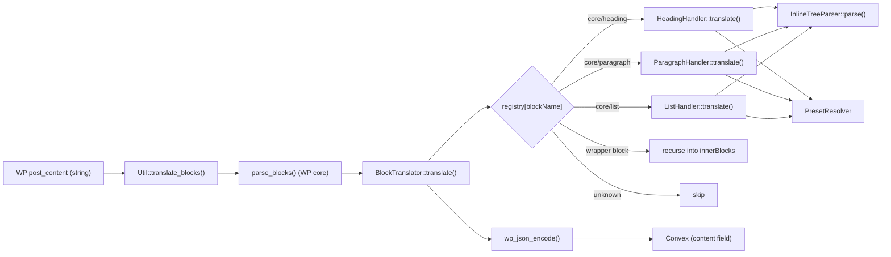

# Block Handlers

This directory translates Gutenberg blocks (as returned by WordPress core's `[parse_blocks()](https://developer.wordpress.org/reference/functions/parse_blocks/)`) into a structured JSON shape that a headless React renderer consumes to render React components.

The translated JSON is what `RestApi::handle_create_post` / `handle_update_post` send to Convex under the `content` field — see `[includes/RestApi.php](../RestApi.php)`.

## High-level flow



The entry point is `[Util::translate_blocks()](../Util.php)`, which parses the post content, hands the parsed block list to a `BlockTranslator` pre-loaded with the default handlers (`BlockTranslator::with_defaults()`), and JSON-encodes the result.

## Files in this directory

| File                                                     | Purpose                                                                                                                                                                                                      |
| -------------------------------------------------------- | ------------------------------------------------------------------------------------------------------------------------------------------------------------------------------------------------------------ |
| `[BlockHandlerInterface.php](BlockHandlerInterface.php)` | One-method contract every block handler implements: `translate(array $block): array`.                                                                                                                        |
| `[AbstractBlockHandler.php](AbstractBlockHandler.php)`   | Abstract base class for handlers that share the standard color / typography / spacing / inline-content builders. Subclasses inject the unique parts (level for heading, `dropCap` for paragraph, and so on). |
| `[BlockTranslator.php](BlockTranslator.php)`             | Registry that maps block names to handlers, dispatches translation, and recurses into `innerBlocks` of wrapper blocks.                                                                                       |
| `[HeadingHandler.php](HeadingHandler.php)`               | Translates `core/heading`. Owns only the heading-specific concerns (`level`, `align`, `textAlign`); everything else is inherited from `AbstractBlockHandler`.                                                |
| `[ParagraphHandler.php](ParagraphHandler.php)`           | Translates `core/paragraph`. Owns only `dropCap` and the `attrs.align` → schema `textAlign` mapping; the rest is inherited.                                                                                  |
| `[ListHandler.php](ListHandler.php)`                     | Translates `core/list`. Owns list structure (`ordered`, `reversed`, `start`, `type`, `items` with per-item inline AST and optional nested lists); colors / typography / spacing are inherited.               |
| `[InlineTreeParser.php](InlineTreeParser.php)`           | Parses inline HTML (text + `<strong>`, `<em>`, `<a>`, `<mark>` and aliases) into a canonical recursive AST. Shared by every handler that emits inline content (`content` or `items[].content`).              |
| `[PresetResolver.php](PresetResolver.php)`               | Resolves `theme.json` preset slugs (color / font-size / spacing) into concrete CSS values via `wp_get_global_settings()`.                                                                                    |

## Output schema overview

Every handler emits an associative array with at least a `blockName` key. Fields that accept WordPress presets use a uniform `{ token, resolved }` shape:

-   `token` is the theme.json slug (`vivid-red`, `small`, `50`, …) — `null` when the value is a literal CSS value rather than a preset reference.
-   `resolved` is the concrete CSS value looked up against the active theme — `null` when no theme provides the slug.

The consumer (React) prefers `resolved` for inline styles and falls back to `var(--wp--preset--<kind>--<token>)` for class-based presets. The detailed `core/heading` schema, the TypeScript types, the Zod validation schema, and the React renderer are all documented in the `[heading-block-translator` plan](../../../../../.cursor/plans/) — see the "Consuming the AST in React" section.

## The main subsystems

### 1. `AbstractBlockHandler` — shared builders

Most of WordPress' block-level style metadata is identical across block types: colors (text / background / link), typography (font size, font style, weight, line height, letter spacing, decoration, transform, writing mode), and spacing (padding + margin). `AbstractBlockHandler` lifts every one of those builders out of the individual handlers so each subclass stays small and focused on what makes it unique.

The base class:

-   Owns the shared dependencies (`InlineTreeParser` + `PresetResolver`) and the constructor that injects them.
-   Implements `BlockHandlerInterface` and leaves `translate()` abstract so subclasses must compose their own output shape.
-   Exposes the builders as `protected` methods so subclasses can mix and match:
    -   `build_colors( $attrs, $style )`
    -   `build_typography( $attrs, $style )`
    -   `build_spacing( $style )`
    -   `nullable_string( $value )`

Today `HeadingHandler`, `ParagraphHandler`, and `ListHandler` extend it. Handler-specific code stays in each subclass's `translate()` composition and its private helpers (`build_level()` for heading, `build_drop_cap()` for paragraph, `build_items()` / `list_item_inline_html()` for list).

### 2. `BlockTranslator` — registry and dispatch

The translator holds a `blockName → BlockHandlerInterface` map. `translate()` walks the parsed blocks once, in document order:

1. If the block's name has a registered handler, call it and append the result.
2. Otherwise, if the block has non-empty `innerBlocks`, recurse into them.
3. Otherwise, drop the block.

This means **wrapper blocks like `core/group` and `core/columns` are transparent**: any handled descendant (e.g. a heading inside a column) still surfaces in the output. Wrapper-specific layout data (alignment of a `core/group`, etc.) is intentionally not preserved at this stage; add a dedicated handler when that information is needed.

`BlockTranslator::with_defaults()` is a static factory that pre-registers the built-in handlers. New handlers should be added there:

```php
public static function with_defaults(): self {
    $instance = new self();
    $instance->register(
        'core/heading',
        new HeadingHandler( new InlineTreeParser(), new PresetResolver() )
    );
    $instance->register(
        'core/paragraph',
        new ParagraphHandler( new InlineTreeParser(), new PresetResolver() )
    );
    $instance->register(
        'core/list',
        new ListHandler( new InlineTreeParser(), new PresetResolver() )
    );
    return $instance;
}
```

### 3. `InlineTreeParser` — canonical inline AST

Authoring nesting order in Gutenberg is non-deterministic. The same visible "bold + italic + linked" text can be authored in any of six DOM nestings depending on which format was applied first:

```html
<a><strong><em>x</em></strong></a>
<a><em><strong>x</strong></em></a>
<strong><a><em>x</em></a></strong>
<strong><em><a>x</a></em></strong>
<em><a><strong>x</strong></a></em>
<em><strong><a>x</strong></a></em>
```

All six render identically in the browser but would yield six different ASTs if we mirrored the DOM literally — that would break consumer-side equality and force every renderer to handle every nesting permutation.

The parser **canonicalizes** so that within a contiguous run of identically-marked text the nesting is always the same, outermost first:

```
link > strong > em > mark > text
```

All six source variants above collapse to one tree:

```json
[
	{
		"type": "link",
		"attrs": { "href": "/x" },
		"children": [
			{
				"type": "strong",
				"children": [
					{
						"type": "em",
						"children": [ { "type": "text", "text": "x" } ]
					}
				]
			}
		]
	}
]
```

#### The two-pass algorithm

Canonicalization is implemented as a two-pass walk over the DOM (see `parse_node()`):

**Pass 1 — `collect_leaves()`**. Recursively walk the DOM with an active "mark set" parameter:

-   A text node emits one flat leaf `{ text, marks }` — a snapshot of the marks active at that point.
-   A recognized inline element (`strong`/`b`, `em`/`i`, `a`, `mark`) adds its mark to the set and recurses.
-   Any other element (`<h2>`, `<span>`, …) is **transparent**: its children are walked as if they were direct siblings of the element's parent. This is how the parser handles the heading's own `<h2>` wrapper — no special-casing required.

Each mark in the set is identified by `kind` plus its `attrs`. Two `<a>` with different `href` are distinct marks; two `<mark>` with different `style` are distinct marks. This is what makes attr-aware merging work in pass 2.

**Pass 2 — `fold_leaves_at_depth()`**. After ordering each leaf's mark set by precedence (`order_marks()`), recursively group consecutive leaves that share the mark at the current depth:

-   At each depth, peel off the current mark and emit one wrapper node per contiguous group of leaves that share it.
-   Leaves with no mark at the current depth are emitted directly as text nodes inline with their formatted siblings.
-   The base case is a leaf whose marks are exhausted — it becomes a `text` node.

The grouping uses structural equality (`marks_equal()`): same `kind` + same `attrs`. So `<strong>a</strong><strong>b</strong>` merges into one wrapper, while `<a href="/a">a</a><a href="/b">b</a>` stays as two siblings.

#### Whitespace handling

Pure-whitespace text nodes at the very start or very end of the heading's children are dropped (`trim_outer_whitespace()`). This avoids spurious leading/trailing text nodes from indented markup like:

```html
<h1>
	<mark>highlighted</mark>
</h1>
```

Whitespace _between_ inline siblings is preserved verbatim — that's intentional. The space in `"text <a>link</a>"` becomes part of the preceding text leaf and survives folding.

#### Output node shapes

```
{ type: 'text',   text }
{ type: 'strong', children: [...] }                                    # also <b>
{ type: 'em',     children: [...] }                                    # also <i>
{ type: 'link',   attrs: { href, target?, rel? }, children: [...] }
{ type: 'mark',   attrs: { style?: { backgroundColor?, color? }, hasInlineColor }, children: [...] }
```

The consumer can render the whole AST with a single recursive `switch` over `node.type`.

### 4. `PresetResolver` — theme.json lookups

The resolver wraps `[wp_get_global_settings()](https://developer.wordpress.org/reference/functions/wp_get_global_settings/)` for three preset kinds:

| Method                                 | Reads                  | Used by                                                                                    |
| -------------------------------------- | ---------------------- | ------------------------------------------------------------------------------------------ |
| `resolve_color( $slug )`               | `color.palette`        | `attrs.textColor`, `attrs.backgroundColor`, link color in `style.elements.link.color.text` |
| `resolve_font_size( $slug )`           | `typography.fontSizes` | `attrs.fontSize`                                                                           |
| `resolve_spacing( $slug )`             | `spacing.spacingSizes` | `attrs.style.spacing.padding                                                               |
| `extract_preset_slug( $value, $kind )` | (parser helper)        | Pulls the slug out of `var:preset                                                          |

#### Origin priority

`wp_get_global_settings()` returns palette data merged from up to three origins:

-   `default` — WordPress core's built-in palette
-   `theme` — values from the active theme's `theme.json`
-   `custom` — Site Editor user customizations

Specificity rises in that order: a theme-defined `vivid-red` overrides core's, and a user customization overrides both. `lookup_preset_value()` honours this in two ways:

-   **Flat lists**: when WP returns a flat array of `[{slug, color}, …]` with concatenated entries from each origin, the _last_ matching slug wins.
-   **Origin-grouped maps**: when WP returns `{ default: [...], theme: [...], custom: [...] }`, the walk visits origins in priority order (`custom > theme > default`) and returns the first match.

This is the reason `resolve_color('pale-cyan-blue')` returns the theme's value even when WP core also defines a `pale-cyan-blue` default.

## How `HeadingHandler` puts it together

`HeadingHandler::translate()` is short and declarative — each output field has a dedicated builder so the schema is easy to extend without sprawling logic:

```php
return array(
    'blockName'  => 'core/heading',
    'level'      => $this->build_level( $attrs ),
    'align'      => $this->nullable_string( $attrs['align'] ?? null ),
    'textAlign'  => $this->nullable_string( $attrs['textAlign'] ?? null ),
    'colors'     => $this->build_colors( $attrs, $style ),
    'typography' => $this->build_typography( $attrs, $style ),
    'spacing'    => $this->build_spacing( $style ),
    'content'    => $this->inline_parser->parse( $inner_html ),
);
```

Per-field rules worth knowing:

-   **Level** defaults to `2` when missing and is clamped to `1..6`.
-   **Colors** read three sources:
    -   `attrs.textColor` → bare slug → `resolve_color()`.
    -   `attrs.backgroundColor` → bare slug → `resolve_color()`.
    -   `attrs.style.elements.link.color.text` → either a `var:preset|color|<slug>` token (extracted and resolved) or a literal CSS color (passed through with `token: null`).
-   **Typography**:
    -   `fontSize` prefers `attrs.fontSize` (preset slug → resolved). Falls back to `attrs.style.typography.fontSize` (custom value → `{ token: null, resolved: "<value>" }`).
    -   All other typography fields (`fontStyle`, `fontWeight`, `lineHeight`, `letterSpacing`, `textDecoration`, `textTransform`, `writingMode`) are read straight out of `attrs.style.typography.`\* as nullable strings.
-   **Spacing**: `padding` and `margin` each become `{ top, right, bottom, left }` maps where every side is either a `{ token, resolved }` preset entry (for `var:preset|spacing|<slug>` references) or `{ token: null, resolved: '<literal>' }`. The whole sides map collapses to `null` when every side is missing, keeping the JSON tight.
-   **Content**: `block.innerHTML` is passed to `InlineTreeParser::parse()`. The parser's "transparent unknown elements" rule means the `<h2>` wrapper is automatically skipped — the parser sees the heading's children as if they were the document.

## How `ParagraphHandler` differs

`ParagraphHandler` extends the same `AbstractBlockHandler` and shares every color / typography / spacing / inline-content concern with the heading. The unique pieces are:

-   **`dropCap`** (`bool`): mirrors `attrs.dropCap`, defaulting to `false`. Only the literal boolean `true` enables the cap — any other value (truthy strings, numbers, etc.) is treated as `false` to keep the schema narrow.
-   **`textAlign`** (`'left' | 'center' | 'right' | null`): WordPress stores paragraph text alignment in `attrs.align` with the same `left | center | right` values heading exposes under `textAlign`. To let consumers share alignment-rendering logic across block types, the handler emits the schema field as `textAlign` (not `align`). Paragraphs don't support block-level `wide` / `full`, so there is intentionally no `align` field on the paragraph schema.

Everything else (`colors`, `typography`, `spacing`, `content`) is byte-for-byte the same shape as on the heading schema, which means the React consumer can route both block types through one set of helpers for those parts of the document.

## How `ListHandler` differs

Lists are **container blocks**: item text lives on `core/list-item` children, not on the list wrapper's `innerHTML`. Nested lists inside a list-item are embedded under `items[].nested` rather than emitted as separate top-level translated blocks (the registry stops recursing once a handler matches).

```php
return array(
    'blockName'  => 'core/list',
    'ordered'    => $this->build_ordered( $attrs ),
    'reversed'   => $this->build_reversed( $attrs ),
    'start'      => $this->build_start( $attrs ),
    'type'       => $this->nullable_string( $attrs['type'] ?? null ),
    'colors'     => $this->build_colors( $attrs, $style ),
    'typography' => $this->build_typography( $attrs, $style ),
    'spacing'    => $this->build_spacing( $style ),
    'items'      => $this->build_items( $block ),
);
```

Per-field rules worth knowing:

-   **`ordered` / `reversed`**: only literal boolean `true` enables each flag — same strictness as paragraph `dropCap`.
-   **`start`**: `null` when absent; otherwise a positive integer (`attrs.start` on ordered lists).
-   **`type`**: list-style type for ordered lists (`upper-alpha`, `lower-roman`, …); `null` when absent (browser default decimal).
-   **`items`**: built by walking `innerBlocks` for `core/list-item`. Each item has:
    -   **`content`**: inline AST parsed from the list-item's `innerContent` string fragments only (skipping `null` placeholders for nested blocks so nested `<ul>` / `<ol>` markup is not parsed twice).
    -   **`nested`**: optional structural subtree (`ordered`, `reversed`, `start`, `type`, `items`) when the list-item contains a nested `core/list` in `innerBlocks`.
-   **Colors / typography / spacing**: identical shape to heading and paragraph — the React consumer can reuse the same style helpers.

## How `ImageHandler` differs

`ImageHandler` extends `AbstractBlockHandler` and depends on `MediaSync` to ensure each block’s attachment is synced before translation. It always emits the full image AST (alignment, sizing, lightbox, link, border, duotone, spacing, etc.); the headless renderer may ignore fields it does not render yet.

| Block source                | `attrs.id` | Behavior on post sync                                   |
| --------------------------- | ---------- | ------------------------------------------------------- |
| Upload / Media Library pick | present    | `ensure_attachment_synced(id)` → AST includes `mediaId` |
| Insert from URL             | absent     | **Fail** — `BlockTranslationException`                  |

```php
return array(
    'blockName'   => 'core/image',
    'mediaId'     => /* from MediaSync */,
    'alt'         => /* attrs.alt or '' */,
    'caption'     => /* figcaption inline AST or [] */,
    'align'       => $this->nullable_string( $attrs['align'] ?? null ),
    'className'   => $this->nullable_string( $attrs['className'] ?? null ),
    'sizeSlug'    => $this->nullable_string( $attrs['sizeSlug'] ?? null ),
    'width'       => $this->nullable_string( $attrs['width'] ?? null ),
    'height'      => $this->nullable_string( $attrs['height'] ?? null ),
    'aspectRatio' => $this->nullable_string( $attrs['aspectRatio'] ?? null ),
    'scale'       => $this->nullable_string( $attrs['scale'] ?? null ),
    'lightbox'    => /* { enabled: bool } or null */,
    'link'        => /* { destination, url } */,
    'colors'      => /* text, background, link, border, duotone */,
    'spacing'     => $this->build_spacing( $style ),
    'border'      => /* width, radius, color from style.border */,
);
```

-   **Caption**: parsed from `<figcaption class="wp-element-caption">` in `innerHTML` via `InlineTreeParser::parse_node()`.
-   **Colors**: extends the shared map with `border` (`attrs.borderColor`) and `duotone` (`attrs.style.color.duotone` preset token).
-   **Tests**: index-driven assertions against [`tests/data/sample-image-block-variants.html`](../../tests/data/sample-image-block-variants.html) in `ImageHandlerTest` (stub `MediaSync`, fake `PresetResolver`).

## Adding a new block handler

1. **Create the handler** under this directory. Extend `AbstractBlockHandler` so you inherit the shared color / typography / spacing builders and the `InlineTreeParser` + `PresetResolver` plumbing — your subclass only owns its block-specific fields. Leaf blocks (heading, paragraph) emit a top-level `content` AST; container blocks like `core/list` walk `innerBlocks` instead:

```php
 namespace PostToConvex\BlockHandlers;

 class ListHandler extends AbstractBlockHandler {

     public function translate( array $block ): array {
         $attrs = is_array( $block['attrs'] ?? null ) ? $block['attrs'] : array();
         $style = is_array( $attrs['style'] ?? null ) ? $attrs['style'] : array();

         return array(
             'blockName'  => 'core/list',
             'ordered'    => /* … */,
             'reversed'   => /* … */,
             'start'      => /* … */,
             'type'       => $this->nullable_string( $attrs['type'] ?? null ),
             'colors'     => $this->build_colors( $attrs, $style ),
             'typography' => $this->build_typography( $attrs, $style ),
             'spacing'    => $this->build_spacing( $style ),
             'items'      => $this->build_items( $block ),
         );
     }
 }
```

2. **Register it** in `BlockTranslator::with_defaults()`:

```php
 $instance->register(
     'core/list',
     new ListHandler( new InlineTreeParser(), new PresetResolver() )
 );
```

3. **Add tests** under `[tests/](../../tests/)` following the established pattern:

-   A focused unit test per output field for the handler.
-   Reuse `InlineTreeParserTest` and `PresetResolverTest` — they already cover the shared subsystems.
-   For handler tests that depend on preset resolution, **inject a stubbed `PresetResolver`** (anonymous class extending `PresetResolver`) so assertions don't depend on the active theme.

4. **Run the suite** from WSL — Docker must be invoked through WSL per `[AGENTS.md](../../../../../AGENTS.md)`:

```bash
 docker exec -u root -w /var/www/html/wp-content/plugins/post-to-convex wp composer run test
```

## Testing notes

Tests live in `[wp-content/plugins/post-to-convex/tests/](../../tests/)` and use the standard WordPress test harness (`WP_UnitTestCase`).

-   `**InlineTreeParserTest**` drives the parser with hand-written snippets, including a `@dataProvider` that feeds all six bold/italic/link source orderings and asserts they collapse to the same canonical AST.
-   `**PresetResolverTest**` exercises the real WP integration via a `wp_theme_json_data_theme` filter, using `ptc-test-*` slugs that intentionally do not collide with WP core defaults so the test assertions are unambiguous.
-   `**HeadingHandlerTest**`, `**ParagraphHandlerTest**`, and `**ListHandlerTest**` drive their respective handlers through every variant in `[tests/data/sample-heading-block-variants.html](../../tests/data/sample-heading-block-variants.html)`, `[tests/data/sample-paragraph-block-variants.html](../../tests/data/sample-paragraph-block-variants.html)`, and `[tests/data/sample-list-block-variants.html](../../tests/data/sample-list-block-variants.html)`. None uses a real `PresetResolver` — each injects an anonymous subclass that returns canned values for the sample's slugs. This decouples the handler tests from WordPress' theme.json merge behavior, which is exercised separately in `PresetResolverTest`. Each suite also includes an integration guard (`test_inline_content_canonicalization_collapses_all_orderings`) that feeds the six link/strong/em author orderings through `Handler::translate()` and asserts they all collapse to the canonical `link > strong > em > text` tree.
-   `**ImageHandlerTest**` drives every variant in [`tests/data/sample-image-block-variants.html`](../../tests/data/sample-image-block-variants.html) with a stub `MediaSync` and fake `PresetResolver`.
-   `**BlockTranslatorTest**` uses an in-test anonymous class implementing `BlockHandlerInterface` to verify registry dispatch, `innerBlocks` recursion, and the end-to-end `Util::translate_blocks()` JSON round-trip. It also asserts the `with_defaults()` factory registers `core/heading`, `core/paragraph`, `core/list`, and `core/image`.
-   `**tests/Support/BlockHandlerTestSupport**` is a trait shared by the handler test suites. It provides `make_fake_resolver(array $palette, array $font_sizes, array $spacing)` (the stubbed `PresetResolver` factory) and `load_blocks_of_type(string $sample_filename, string $block_name)` (the sample-loader that flattens blocks by name — for lists, only **top-level** `core/list` blocks are indexed because nested lists inside list-items are not descended into after a name match). New handler tests should reuse this trait so each test class stays focused on its handler's assertions.

The fake-resolver pattern is the recommended approach for any handler whose output depends on preset resolution. It keeps unit-test concerns separate (translator logic vs. theme.json plumbing) and avoids flakiness from whichever theme the test environment happens to load.
